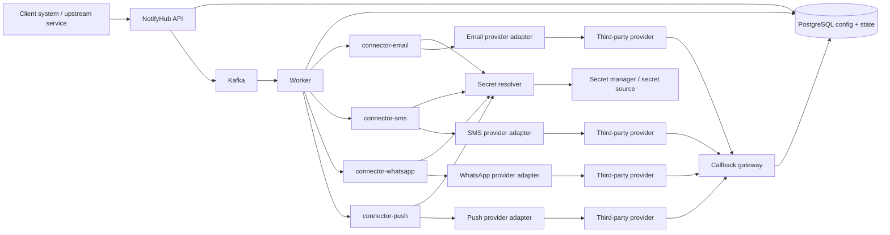
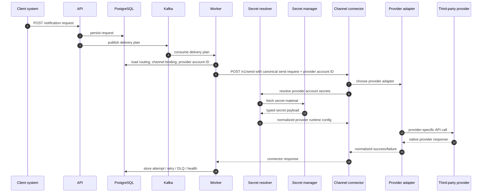
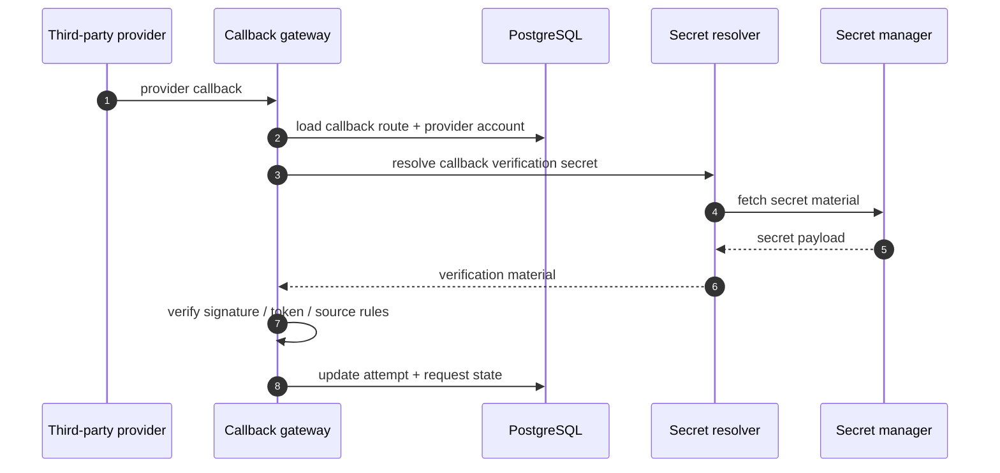
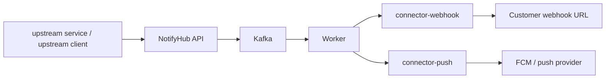

# Managed Provider Platform Design

This document describes the target architecture for evolving the NotifyHub from:

- "clients bring and host their own connectors"

to:

- "the control plane provides first-party connectors and provider adapters out of the box"

In this target model, client systems only need to:

- send canonical notification requests
- register provider accounts during onboarding or deployment
- store provider credentials securely through the control plane once, not per request
- configure routing and binding preferences

The control plane then owns:

- provider-specific API integrations
- retries and failover
- callback normalization
- secure runtime credential retrieval
- observability and auditability

For the phased delivery sequence, see [Managed Provider Platform Implementation Plan](/docs/architecture/managed-provider-platform-implementation-plan.md).

## Problem Statement

The current system is strong at canonical request intake, worker orchestration, retries, dead letters, bindings, and callback normalization.

The weak point is the connector and secret model:

- provider bindings point directly to `endpoint_url`
- provider bindings store `config_refs` as loose string maps
- runtime credential handling is split across the worker and connector boundary today
- clients are implicitly expected to supply or host connector behavior for unsupported providers

That is acceptable for a bootstrap phase, but it is not the right product shape for a trusted notification platform.

The stronger product shape is:

- first-party connectors by channel
- first-party provider adapters inside those connectors
- typed provider configuration models
- typed secret references
- centralized secret provisioning at onboarding, with runtime resolution at the connector boundary

## Target Product Shape

The platform should provide these channel connectors:

- `connector-email`
- `connector-sms`
- `connector-whatsapp`
- `connector-push`
- `connector-webhook`

Each channel connector can support multiple provider adapters.

Examples:

- `connector-sms`
  - Twilio
  - Gupshup
  - Karix
- `connector-email`
  - SES
  - SendGrid
  - Mailgun
- `connector-whatsapp`
  - Meta WhatsApp Cloud API
  - Gupshup WhatsApp
  - Karix WhatsApp
- `connector-push`
  - FCM
  - APNs or APNs-through-provider integrations where needed

Clients do not write those connectors for standard providers.

## Service Architecture



## Main Design Principle

Keep the system split into three layers:

### 1. Canonical control-plane layer

This stays provider-agnostic.

It owns:

- notification requests
- delivery attempts
- retries
- dead letters
- routing policies
- preference policies
- channel bindings

It should never know:

- Twilio URL structure
- Gupshup auth headers
- FCM service-account parsing details
- WhatsApp template submission quirks

Notification requests stay secret-free. They may choose channels and templates, but they should not carry provider accounts, secret references, or provider credentials on the hot path.

### 2. Managed connector layer

This stays channel-oriented.

It owns:

- normalized connector contract
- adapter dispatch to the selected provider implementation
- provider-specific payload translation
- provider-specific response mapping
- provider-specific error classification

### 3. Secret and provider account layer

This stays security-oriented.

It owns:

- provider account registration
- typed provider configuration validation
- secure secret references
- runtime secret retrieval for the connector boundary
- audit trails around secret access and provider changes

## Extension Rules

Provider support stays easy to extend when every new provider follows the same shape.

The rules are:

- one provider definition per provider family
- one provider account per tenant/provider combination
- one adapter implementation per provider behavior
- one normalized connector contract per channel
- one secret material type per secret shape

That keeps new providers from forcing changes across the whole system.

### What a new provider must provide

- a provider definition with required config schema
- a provider account config example
- a callback route shape, if callbacks exist
- an adapter implementation inside the correct channel connector
- contract tests for send, success, failure, and callback behavior

### What a new provider must not do

- add a new request shape for clients
- leak secrets into notification requests
- require worker-specific branching
- bypass the provider-definition schema

### Why this stays easy to extend

- the worker still only sees channels, bindings, and provider-account IDs
- the connector owns provider-specific API translation
- the secret resolver owns secret retrieval
- the callback gateway owns provider callback normalization
- the storage model separates provider identity from provider credentials

## Proposed Domain Models

The current `ProviderBinding` model is not enough by itself for the managed-provider design.

We should add a few explicit models around it.

## Model: ProviderDefinition

This is a first-party catalog entry shipped by the platform.

It describes a provider the platform knows how to talk to.

Example:

```json
{
  "provider_key": "twilio-sms",
  "channel": "sms",
  "connector_name": "connector-sms",
  "adapter_key": "twilio",
  "display_name": "Twilio SMS",
  "capabilities": ["sms"],
  "required_config_schema": {
    "account_sid": "secret_string",
    "auth_token": "secret_string",
    "from_number": "plain_string"
  },
  "callback_mode": "provider_callback"
}
```

Why it exists:

- tells the API and UI what providers are supported
- tells validation code what configuration shape is required
- tells the worker and connectors which adapter to use

## Model: ProviderAccount

This is a tenant or client-specific configured provider instance created during onboarding or deployment.

It says, "this customer wants to use Twilio SMS with these settings."

Example:

```json
{
  "provider_account_id": "provacct_sms_twilio_prod",
  "tenant_id": "upstream service",
  "provider_key": "twilio-sms",
  "display_name": "Communication Engine Twilio Production",
  "channel": "sms",
  "enabled": true,
  "config": {
    "from_number": "+14155550123"
  },
  "secret_refs": {
    "account_sid": "secret://tenant/upstream service/twilio/account-sid",
    "auth_token": "secret://tenant/upstream service/twilio/auth-token"
  }
}
```

Why it exists:

- separates provider choice from provider credentials
- lets one tenant have multiple accounts for the same provider
- lets the platform validate required fields before runtime
- keeps secrets out of notification request traffic

## Model: Template

Templates remain channel-scoped, but they should also be language-scoped.

Example:

```json
{
  "template_key": "login-otp-v1",
  "channel": "sms",
  "language_code": "hi-in",
  "subject_template": "",
  "body_template": "नमस्ते {{name}}, आपका OTP {{otp}} है.",
  "metadata": {
    "use_case": "authentication"
  },
  "enabled": true
}
```

Why it exists:

- lets one logical template have multiple translations
- keeps the request model generic
- defaults to English when `language_code` is omitted
- lets the worker fall back to English when a translation is missing

## Model: SecretReference

This should be typed, not a loose env-var name string.

Example:

```json
{
  "ref": "secret://tenant/upstream service/fcm/service-account",
  "material_type": "secret_json",
  "source": "vault",
  "version": "current"
}
```

Supported material types should be small and explicit:

- `secret_string`
- `secret_json`
- `secret_file`

Why it exists:

- supports API keys, tokens, JSON blobs, and credential files safely
- removes provider-specific hacks from `config_refs`
- gives the runtime a stable contract

## Model: ChannelBinding

This should evolve from today's `ProviderBinding`.

Today the binding points directly to:

- `connector_name`
- `endpoint_url`
- `config_refs`

The target binding should point to:

- channel
- binding set
- provider account
- priority
- enabled flag

Example:

```json
{
  "binding_id": "binding_sms_primary_twilio",
  "channel": "sms",
  "binding_set": "transactional-sms",
  "provider_account_id": "provacct_sms_twilio_prod",
  "priority": 10,
  "enabled": true
}
```

Why it exists:

- provider account selection becomes explicit
- connectors stop being tenant-provided infrastructure
- the worker no longer needs tenant-supplied `endpoint_url` or secret material

## Model: CallbackRoute

Some providers send callbacks in different shapes or need account-specific correlation.

Example:

```json
{
  "provider_key": "twilio-sms",
  "provider_account_id": "provacct_sms_twilio_prod",
  "callback_path": "/v1/providers/twilio-sms/prod-account-1/callbacks",
  "verification_mode": "signature",
  "verification_secret_ref": "secret://tenant/upstream service/twilio/webhook-signing-secret"
}
```

Why it exists:

- callback verification becomes explicit
- the callback gateway can route and validate safely

## Runtime Send Flow



## Runtime Callback Flow



## Safe Secret Storage And Retrieval

This is the most important part of the design.

The control plane database should store:

- secret metadata
- secret references
- provider account config

It should not store:

- plaintext API keys
- plaintext auth tokens
- raw service-account JSON
- raw webhook verification secrets

### What lives in Postgres

- `provider_accounts`
  - non-secret config
  - typed secret references
- `channel_bindings`
  - binding set and priority information
- `callback_routes`
  - provider account mapping and verification mode
- audit tables
  - who changed provider config
  - when a provider account was enabled or disabled

### What lives in the secret manager

- provider API keys
- provider auth tokens
- service-account JSON
- signing secrets
- certificate or file-style credential content

### What the worker gets at runtime

The worker should not manually interpret random env var names or fetch secret material directly.

It should only load the routing decision and provider account reference, then hand the provider account ID to the connector.

Example runtime handoff:

```json
{
  "channel": "push",
  "provider_account_id": "provacct_push_fcm_stage",
  "binding_set": "push-default"
}
```

### Secret resolver responsibilities

- fetch secret material from the configured backend
- validate material type against the provider definition
- normalize the material for connector use at the connector boundary
- redact values in logs and metrics
- optionally cache secrets for a short TTL
- emit audit records for fetch failures and suspicious access patterns

## Example: SMS with Twilio

### Provider definition

```json
{
  "provider_key": "twilio-sms",
  "channel": "sms",
  "connector_name": "connector-sms",
  "adapter_key": "twilio",
  "required_config_schema": {
    "account_sid": "secret_string",
    "auth_token": "secret_string",
    "from_number": "plain_string"
  }
}
```

### Provider account

```json
{
  "provider_account_id": "provacct_sms_twilio_prod",
  "provider_key": "twilio-sms",
  "config": {
    "from_number": "+14155550123"
  },
  "secret_refs": {
    "account_sid": "secret://tenant/upstream service/twilio/account-sid",
    "auth_token": "secret://tenant/upstream service/twilio/auth-token"
  }
}
```

### Binding

```json
{
  "channel": "sms",
  "binding_set": "transactional-sms",
  "provider_account_id": "provacct_sms_twilio_prod",
  "priority": 10
}
```

At runtime:

- the worker loads the binding
- the worker loads the provider account
- the worker calls `connector-sms` with the provider account ID
- `connector-sms` resolves Twilio secrets through the secret resolver
- `connector-sms` selects the `twilio` adapter
- the adapter makes the Twilio REST call

## Example: Push with FCM

### Provider definition

```json
{
  "provider_key": "fcm-push",
  "channel": "push",
  "connector_name": "connector-push",
  "adapter_key": "fcm",
  "required_config_schema": {
    "project_id": "plain_string",
    "service_account_json": "secret_json"
  },
  "callback_mode": "none"
}
```

### Provider account

```json
{
  "provider_account_id": "provacct_push_fcm_stage",
  "provider_key": "fcm-push",
  "config": {
    "project_id": "nurture-farm"
  },
  "secret_refs": {
    "service_account_json": "secret://tenant/upstream service/fcm/nurture-farm-service-account"
  }
}
```

At runtime:

- the worker passes the provider account ID to `connector-push`
- `connector-push` resolves the JSON blob through the secret resolver
- `connector-push` selects the `fcm` adapter
- the adapter builds an authenticated FCM request with that credential material

## Runtime Connector Paths

Webhook and push are first-party connectors too. The difference is where the connector sends the request:

- webhook sends to the customer-owned destination URL
- push sends to FCM or another push provider endpoint



At runtime:

- the worker passes the resolved destination and provider account to `connector-webhook`
- `connector-webhook` posts the normalized payload to the configured customer URL
- the worker passes the provider account to `connector-push`
- `connector-push` resolves the JSON blob through the secret resolver
- `connector-push` selects the `fcm` adapter and sends to the provider endpoint

## Required Service Changes

This target design requires real changes to the current control plane.

### API changes

- add first-party provider catalog endpoints
- add provider account CRUD endpoints
- add channel binding CRUD that references provider accounts
- add callback route CRUD or derive callback routes from provider accounts
- add stronger validation for provider-specific config

### Storage changes

- add `provider_definitions` or ship them as code-backed catalog records
- add `provider_accounts`
- add `channel_bindings` or evolve `provider_bindings`
- add `callback_routes`
- add audit records for provider and secret-reference changes

### Worker changes

- stop resolving raw env-var names from `config_refs`
- resolve provider accounts and typed secret refs instead
- call first-party connectors by stable internal endpoint
- emit clearer failure classifications for secret-resolution errors

### Connector changes

- evolve from "one service equals one simple example provider path"
- to "one service per channel with internal provider adapters"
- normalize provider-specific request and response handling
- expose stable callback correlation metadata

### Callback gateway changes

- support provider-specific verification
- route callbacks using provider definitions and provider accounts
- support account-level verification secrets

## Deployment Model

In local development, these managed connectors can still live in the same compose stack.

In production, they should be treated as first-party control-plane services, even if they are deployed separately from the core API and worker.

That means:

- clients do not host them
- clients do not implement standard provider adapters
- clients only register provider accounts and secrets

## Recommended Rollout Strategy

### Phase 1: Secure provider accounts

- keep the current connectors
- add typed secret refs
- add provider account model
- remove direct env-var-name dependence from bindings

### Phase 2: First-party managed provider adapters

- add first-party provider catalog
- move from connector endpoint ownership by clients to control-plane-owned connectors
- add Twilio, Gupshup, Karix, FCM, and one email provider as the first supported set

### Phase 3: Callback verification and hardened operations

- add signed callback verification
- add audit logs
- add RBAC around provider account changes
- add metrics and alerts around secret resolution and provider-account health

## Summary

The target architecture should be:

- clients send canonical requests
- clients register provider accounts and secret references
- the control plane owns first-party connectors
- connectors own provider adapters
- the worker stays provider-agnostic
- secrets are stored outside Postgres and resolved at runtime through a typed resolver

That is the product shape that lets clients trust the NotifyHub as a real managed delivery platform instead of a framework they still have to finish themselves.
