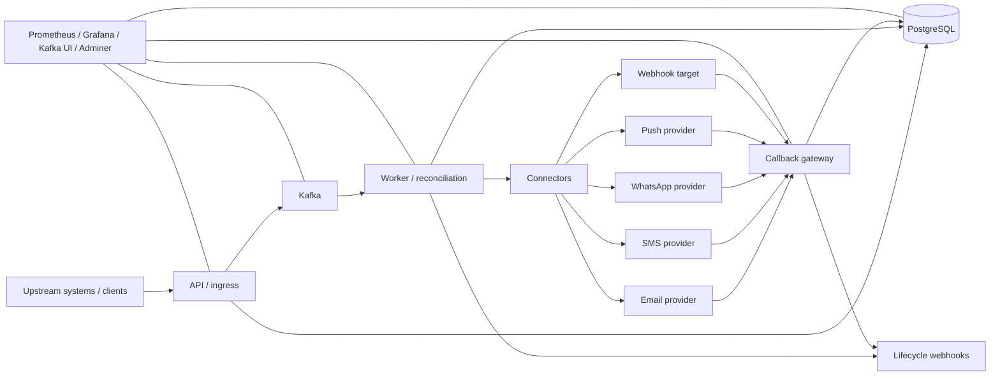
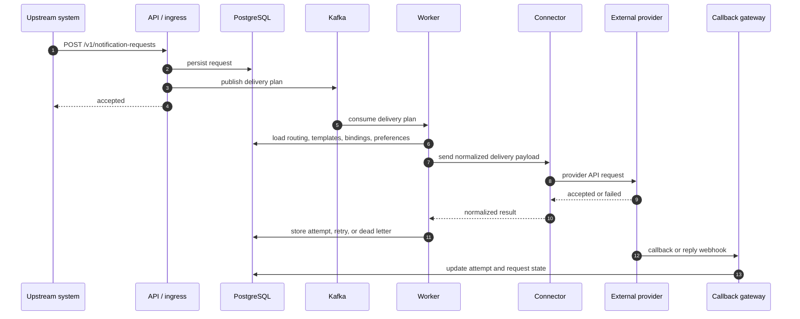

# NotifyHub High-Level System Design

This document is the compact system map for NotifyHub. It is intentionally high level so it can be pasted into a diagramming tool such as Eraser, or used as the top-level architecture reference for demos and onboarding.

## System Boundary

NotifyHub is a notification control plane.

- Upstream systems decide **what should happen**.
- NotifyHub decides **how the message gets delivered**.

The platform owns:

- request intake
- policy resolution
- routing
- template selection
- provider selection and failover
- delivery retries and dead letters
- callback reconciliation
- lifecycle webhooks
- observability

## High-Level Runtime View

## Core Components

### API / ingress

Accepts notification requests and admin configuration.

Responsibilities:

- authenticate the client
- validate request shape
- persist canonical request state
- enqueue work to Kafka
- expose configuration APIs for provider accounts, bindings, routes, templates, preferences, and subscriptions

### Worker / reconciliation

Consumes delivery plans and decides how to send the notification.

Responsibilities:

- resolve routing policy
- resolve template variant by `template_key + channel + language_code`
- resolve provider binding and provider account
- apply user preferences
- render template content
- call the correct connector
- classify retryable vs terminal failures
- create retries or dead letters

### Connectors

Translate the generic control-plane request into provider-specific API calls.

Examples:

- email
- SMS
- WhatsApp
- push
- webhook

### Callback gateway

Receives provider delivery callbacks and reply events.

Responsibilities:

- verify callback authenticity
- normalize provider-specific payloads
- correlate the callback with a stored attempt
- update request and attempt state
- emit lifecycle webhook updates

### PostgreSQL

System of record for:

- notification requests
- delivery attempts
- provider accounts
- provider bindings
- routing policies
- preference policies
- templates
- delivery policies
- callback routes
- webhook subscriptions
- dead letters

### Kafka

Asynchronous work backbone.

Used for:

- request fan-out
- worker processing
- retry replay
- lifecycle event propagation

## End-To-End Flow

## Control-Plane Data Model

The key model chain is:

`client -> request -> route -> template -> binding set -> provider account -> connector -> provider callback`

The important point is that the business client only needs to know:

- event name
- channel
- recipient
- template key
- language code

Everything else is resolved by NotifyHub.

## What Makes It Generic

NotifyHub stays generic because the client service does not embed provider logic.

Instead, the control plane stores:

- provider account config
- secret references
- callback routes
- routing policies
- binding sets
- templates
- preferences

That means a new upstream service can integrate without knowing whether delivery happens through SMTP, Gupshup, Karix, FCM, or any future provider.

## Suggested Eraser Layout

If you want to recreate this in app.eraser.io, use this layout:

1. Left column: `Upstream systems / clients`
2. Center top: `API / ingress`
3. Center middle: `PostgreSQL` and `Kafka`
4. Center right: `Worker / reconciliation`
5. Far right: `Connectors` and external providers
6. Bottom row: `Callback gateway`, lifecycle webhooks, and observability

The main arrows should show:

- client request intake
- async worker processing
- provider delivery
- callback return path
- observability alongside the stack

