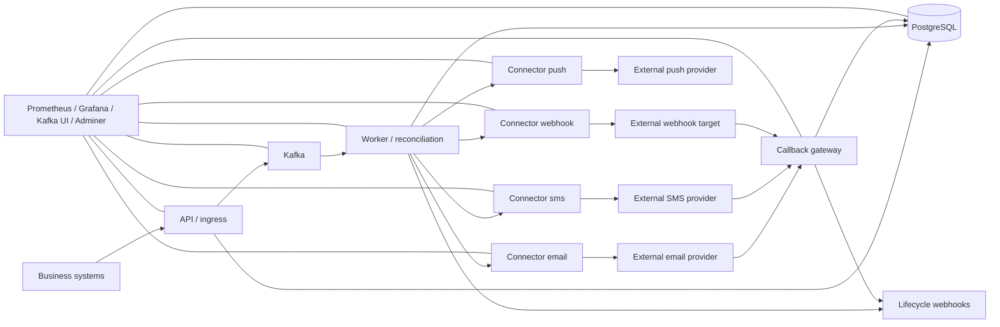
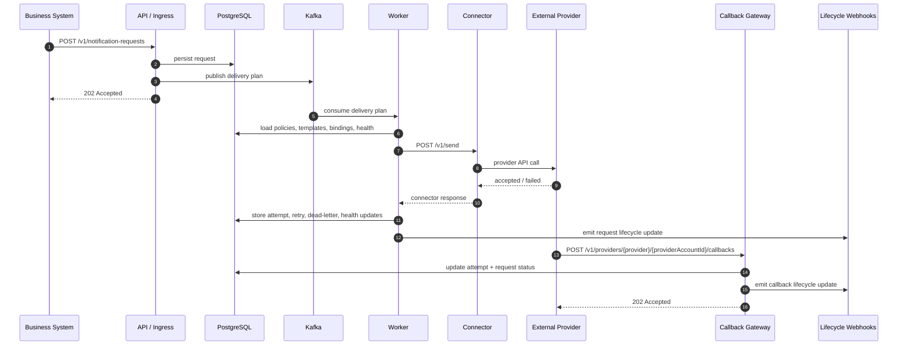

# System Architecture Dock

This page is the big-picture map of the NotifyHub: what runs where, how requests move through it, and which parts own each stage of the delivery lifecycle.

For deeper reading, see:

- [Current Runtime Architecture](/docs/architecture/v1.md)
- [Managed Provider Platform Design](/docs/architecture/managed-provider-platform.md)
- [Connector Integration Guide](/docs/connector-sdk.md)
- [Upstream Service Multi-Channel Integration](/docs/integrations/upstream-service-multi-channel.md)

## The Short Version

The system is a durable notification pipeline:

1. Business systems submit notification intent to the API.
2. The API validates, persists, and enqueues that request.
3. Kafka hands the work to the worker.
4. The worker resolves policy, renders content, selects a provider binding, and dispatches to a connector.
5. The connector talks to the external provider.
6. Provider callbacks come back through the callback gateway and update durable state.
7. Observability tooling watches the whole stack from the side.

The platform owns delivery mechanics. Client systems own business intent.

## Big Architecture View

## Request Lifecycle

## Component Placement

### Request ingress

- `apps/api`
- Accepts notification requests and control-plane config CRUD
- Persists canonical request state before async work starts
- Enqueues the delivery plan to Kafka

### Async reconciliation

- `apps/worker`
- Reads delivery plans from Kafka
- Resolves routing, templates, preferences, provider bindings, and retry decisions
- Records attempts, retries, dead letters, and provider health

### Callback return path

- `apps/callback-gateway`
- Receives provider delivery callbacks
- Normalizes provider-specific status into control-plane state
- Updates the stored attempt and request lifecycle records

### Provider adapters

- `connectors/email`
- `connectors/sms`
- `connectors/webhook`
- `connectors/push`
- Normalize outbound transport and provider failure semantics

### Shared platform libraries

- `libs/contracts/notification`
- Shared request, attempt, policy, routing, and connector types
- `libs/core`
- Reusable HTTP, config, rendering, webhook, and service metadata helpers
- `libs/messaging/kafka`
- Kafka publish/consume wrappers
- `libs/storage/postgres`
- Typed persistence layer for all durable control-plane state
- `libs/observability`
- Logging, metrics, and runtime instrumentation

### Runtime and packaging

- `apps/migrate`
- `build/docker/*.Dockerfile`
- `deployments/docker/*`
- Docker stack for the local control-plane runtime, observability, and dependencies

## Data Flow, End To End

### 1. Ingress

The client submits a `NotificationRequest` to the API.

The API:

- validates the payload
- enforces idempotency
- persists the request
- publishes the delivery plan to Kafka
- emits lifecycle notification updates for accepted intake

### 2. Reconciliation

The worker consumes the delivery plan and decides how to deliver it.

It:

- resolves the effective channels
- resolves the effective binding set
- checks preferences and expiry
- renders template content
- selects the best provider binding
- calls the connector

If delivery fails:

- retryable failures are scheduled
- exhausted retries become dead letters
- provider health and circuit state are updated
- non-retryable failures fail fast

### 3. Provider delivery

Connectors bridge the platform to the external provider APIs.

They return:

- accepted delivery metadata
- or a structured failure with retry classification

### 4. Callback reconciliation

External providers may later call back into the callback gateway.

The callback gateway:

- matches the callback to a stored attempt
- normalizes provider status
- updates attempt and request state in Postgres
- emits lifecycle webhook updates

### 5. Observability and operations

Prometheus, Grafana, Kafka UI, and Adminer sit beside the delivery path.

They do not participate in the delivery flow, but they let operators inspect:

- request acceptance
- delivery latency
- retry backlog
- dead letters
- provider health
- callback outcomes
- storage and queue health

## State Model

The important durable records are:

- notification requests
- delivery attempts
- scheduled retries
- dead letters
- provider bindings
- provider binding health
- routing policies
- preference policies
- templates
- delivery policies
- webhook subscriptions

PostgreSQL is the system of record for all of them.

Kafka is the asynchronous work backbone that connects acceptance to worker reconciliation and retry replay.

## What This System Is Not

This repo is not trying to be:

- a workflow engine
- a campaign builder
- a journey canvas
- a low-code engagement suite

The boundary stays deliberately narrow:

- business systems decide why a notification should happen
- the control plane decides how to deliver it

## Where To Go Next

- Use [API / Ingress Note](/docs/architecture/api-ingress.md) for the request entry path.
- Use [Worker / Reconciliation Note](/docs/architecture/worker-reconciliation.md) for the delivery loop.
- Use [Callback Gateway Note](/docs/architecture/callback-gateway.md) for the return path.
- Use [Connectors / Libraries / Deployment Note](/docs/architecture/scoped-connectors-libs-deployment.md) for platform wiring and stack placement.
