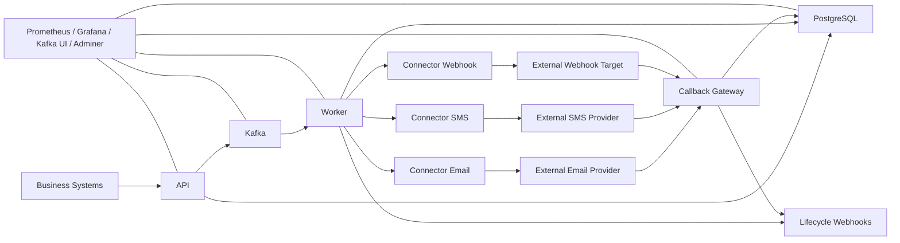

# V1 Architecture

This document describes the current architecture of the NotifyHub as it exists in the repository today.

## Purpose

The platform is a reusable notification infrastructure layer for product teams that want to keep business logic in their own services while outsourcing delivery mechanics to a shared control plane.

Business systems decide:

- why a notification should happen
- who should receive it
- what event or template key it maps to

The platform decides:

- which channels and binding sets should be used
- whether preferences suppress delivery
- how templates are rendered
- how retries, DLQ, replay, failover, and callbacks behave
- how request and attempt state are persisted and observed

## Architecture Overview

## Runtime Components

### API

Responsibilities:

- accept canonical `NotificationRequest` payloads
- validate request shape and idempotency constraints
- persist request state before async processing begins
- publish work to Kafka
- manage templates, routing policies, preference policies, delivery policies, provider bindings, provider binding health, dead letters, and webhook subscriptions
- expose request, retry, attempt, and dead-letter visibility for operators and client systems

### Worker

Responsibilities:

- consume delivery plans from Kafka
- resolve channels, binding sets, preferences, and templates
- select provider bindings by channel, binding set, and priority
- dispatch through connectors
- classify connector failures into retryable and non-retryable categories
- manage scheduled retries, dead letters, and replay flow
- manage provider health and `gobreaker`-backed circuit breaker state
- emit lifecycle webhook notifications

### Callback Gateway

Responsibilities:

- accept provider callback payloads
- normalize provider-specific delivery statuses
- correlate callbacks back to stored delivery attempts
- update request and attempt state
- emit lifecycle webhook notifications after delivery-state changes

### Connectors

Responsibilities:

- expose a normalized HTTP contract to the worker
- translate generic send payloads into provider-specific API calls
- return structured success or structured failure metadata

Current reference connectors:

- `email`
- `sms`
- `webhook`

### Migration Runner

Responsibilities:

- apply versioned SQL schema changes in order
- record applied migrations in `schema_migrations`
- give Docker and operators a deterministic database upgrade path

## Core Resources

The control plane revolves around a small set of durable resources.

### Request And Delivery State

- `notification_requests`
- `delivery_attempts`
- `scheduled_retries`
- `dead_letter_notifications`
- `webhook_delivery_attempts`

### Configuration Resources

- `provider_bindings`
- `provider_binding_health`
- `routing_policies`
- `preference_policies`
- `templates`
- `delivery_policies`
- `webhook_subscriptions`

## Storage And Messaging Model

### PostgreSQL

PostgreSQL is the system of record for:

- request state
- delivery attempts
- configuration resources
- scheduled retries
- dead letters
- provider health
- webhook delivery tracking

### Kafka

Kafka is the asynchronous work backbone for:

- request processing fan-out from the API to the worker
- replaying scheduled retries back into the normal worker path
- absorbing bursts independently of API request latency

## Delivery Flow

1. A client submits a `NotificationRequest` to `api`.
2. The API validates the request and enforces idempotency behavior.
3. The API persists the request with an initial status and publishes work to Kafka.
4. The worker consumes the request and resolves the effective channels.
5. The worker resolves the effective binding set:
   - request binding set if present
   - otherwise routing policy binding set if present
   - otherwise the default empty binding set for the channel
   - otherwise legacy channel fallback
6. The worker checks preference policies and suppresses delivery where appropriate.
7. The worker renders the channel template using stored variables.
8. The worker dispatches to the selected connector.
9. The connector returns either:
   - accepted delivery metadata
   - or a classified failure
10. The worker reacts based on failure class:
   - retryable failures create scheduled retries
   - exhausted retries create dead letters
   - non-retryable failures fail fast
11. Provider callbacks later arrive at `callback-gateway`.
12. The callback gateway normalizes delivery state and updates the stored request and attempt records.
13. Lifecycle webhooks are emitted as request state changes.

## Provider Selection Model

Provider selection is intentionally a two-step model.

### Step 1: Routing Chooses Channel And Optional Binding Set

Routing policy decides which channel should be used for an event and may optionally attach a binding set such as:

- `transactional-email`
- `marketing-email`
- `critical-sms`

### Step 2: Bindings Choose The Concrete Connector Order

Within the chosen channel and binding set, the worker loads all active bindings ordered by priority. It then:

- tries the highest-priority eligible binding first
- fails over to the next binding when appropriate
- skips bindings with an open circuit during cooldown

This separation keeps event routing declarative while still allowing multiple providers per channel.

## Reliability Model

The current platform supports:

- idempotent request intake
- durable scheduled retries backed by Postgres
- dead-letter creation after retry exhaustion
- dead-letter replay through the API
- provider failover by priority
- structured connector failure classification
- provider health persistence
- `gobreaker`-backed circuit breakers
- request expiry / TTL enforcement

## Observability Model

The platform exposes:

- `healthz` and `metrics` endpoints on services
- Prometheus scraping
- Grafana dashboards
- Kafka UI
- Adminer

Important tracked areas:

- API outcomes and latency
- per-channel delivery attempts
- retry and dead-letter backlog
- retry pickup delay
- provider failure classifications
- provider circuit-breaker state and events
- callback normalization outcomes
- DB timings
- Kafka consumer lag
- service runtime CPU and memory metrics

## Current Boundaries

The platform intentionally does not yet try to be:

- a campaign builder
- a workflow or journey engine
- a low-code orchestration product
- a full multi-tenant enterprise control plane
- a policy authoring UI

The current boundary is still:

`business systems decide why`

`the platform decides how`
