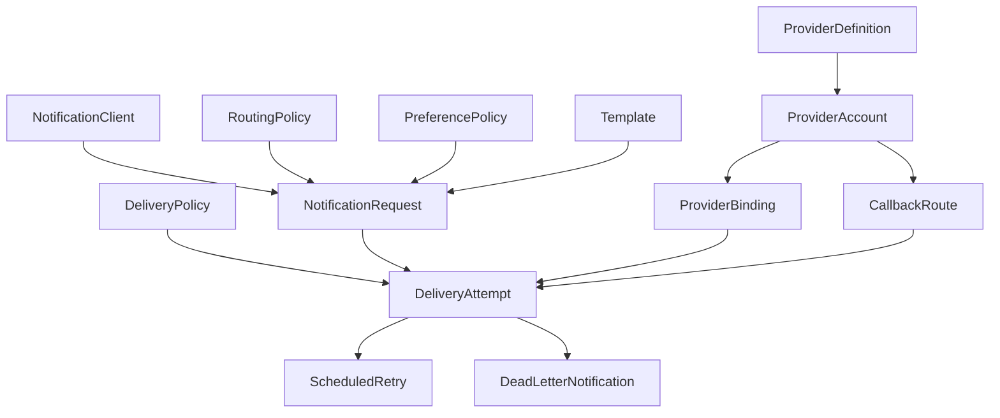

# Runtime Model Interactions

This document explains how the important models interact with each other at runtime.

## Primary Models

The important runtime models are:

- `NotificationClient`
- `NotificationRequest`
- `RoutingPolicy`
- `PreferencePolicy`
- `Template`
- `DeliveryPolicy`
- `ProviderDefinition`
- `ProviderAccount`
- `ProviderBinding`
- `DeliveryAttempt`
- `ScheduledRetry`
- `DeadLetterNotification`
- `CallbackRoute`

## Model Relationship Map

## NotificationClient

Purpose:

- identifies the upstream service
- scopes allowed channels
- gives the request a tenant and source identity

Runtime effect:

- the API authenticates the API key
- the API stamps `source_client_id`, `source_tenant_id`, and `source_client_name` into the request

## NotificationRequest

Purpose:

- the canonical northbound intent record

Carries:

- event name
- language code, if supplied, with English as the default
- channels
- recipient
- variables
- binding set override if provided
- source client identity

Runtime effect:

- the worker uses it as the source of truth for delivery orchestration

## RoutingPolicy

Purpose:

- maps an event name to channels and a default binding set

Runtime effect:

- if a request does not pin a binding set, routing can supply it
- channels can be narrowed or set by the routing policy

## PreferencePolicy

Purpose:

- enables or disables a channel for a user

Runtime effect:

- the worker suppresses delivery on disabled channels before attempting provider send

## Template

Purpose:

- stores the renderable subject and body
- stores channel-specific metadata
- stores the template variant language

Important for WhatsApp:

- provider template names
- media type
- interactive attributes

Runtime effect:

- render layer interpolates request variables
- worker selects the template by `template_key + channel + language_code`
- if the requested language is missing, the worker falls back to English
- worker passes rendered content plus metadata to the connector

## DeliveryPolicy

Purpose:

- sets retry budget and backoff by channel

Runtime effect:

- worker decides whether to retry, fail fast, or dead-letter

## ProviderDefinition

Purpose:

- platform-owned catalog of supported providers

Carries:

- provider key
- channel
- connector name
- required config schema
- config variants
- callback mode

Runtime effect:

- validates provider accounts
- tells the system which connector family owns the provider

## ProviderAccount

Purpose:

- tenant-specific configured provider instance

Carries:

- provider identity
- plain config
- typed secret references

Runtime effect:

- worker loads it through the binding
- connector resolves its secrets and uses it to talk to the provider

## ProviderBinding

Purpose:

- links channel plus binding set to connector endpoint plus provider account

Carries:

- channel
- binding set
- connector endpoint
- provider account ID
- priority

Runtime effect:

- worker chooses a binding in priority order
- the binding determines which provider account and connector are used

## DeliveryAttempt

Purpose:

- one concrete attempt to deliver one request on one channel

Carries:

- attempt number
- connector name
- destination
- provider message ID
- status
- error

Runtime effect:

- callbacks reconcile against it
- retry and dead-letter logic branch from it

## ScheduledRetry

Purpose:

- durable retry record for a future attempt

Runtime effect:

- worker can claim it later and re-enter the same delivery flow

## DeadLetterNotification

Purpose:

- durable exhausted or terminal failure record

Runtime effect:

- operator can inspect and replay it

## CallbackRoute

Purpose:

- provider-specific callback endpoint and verification setup

Carries:

- provider key
- provider account ID
- callback path
- verification mode
- verification secret reference

Runtime effect:

- callback gateway verifies inbound provider events
- updates delivery attempts and request state

## End-To-End Interaction Story

### Ingress phase

1. `NotificationClient` authenticates the caller.
2. API writes `NotificationRequest`.
3. Kafka gets a `DeliveryPlan`.

### Worker decision phase

1. worker loads `RoutingPolicy`
2. worker loads `PreferencePolicy`
3. worker loads `Template`
4. worker loads `DeliveryPolicy`
5. worker loads `ProviderBinding`
6. worker loads `ProviderAccount`

### Delivery phase

1. worker creates `DeliveryAttempt`
2. worker calls the connector
3. connector resolves secrets from `ProviderAccount.secret_refs`
4. connector calls the provider
5. connector returns accepted or failed

### Recovery phase

If retryable:

1. create `ScheduledRetry`

If exhausted:

1. create `DeadLetterNotification`

### Callback phase

1. callback-gateway loads `CallbackRoute`
2. verifies payload
3. finds `DeliveryAttempt` by `provider_message_id`
4. updates `DeliveryAttempt`
5. recomputes parent `NotificationRequest`

## Why This Model Is Generic

This interaction graph is not specific to `upstream service`.

Any upstream service can:

- register as a `NotificationClient`
- send `NotificationRequest`
- rely on the same routing, template, provider, retry, and callback machinery
