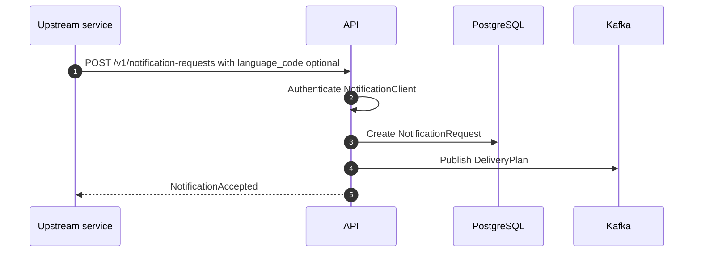
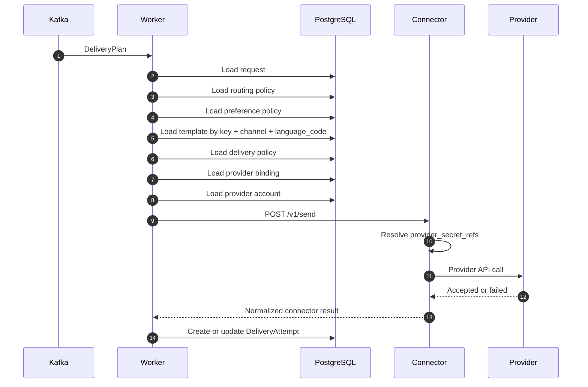
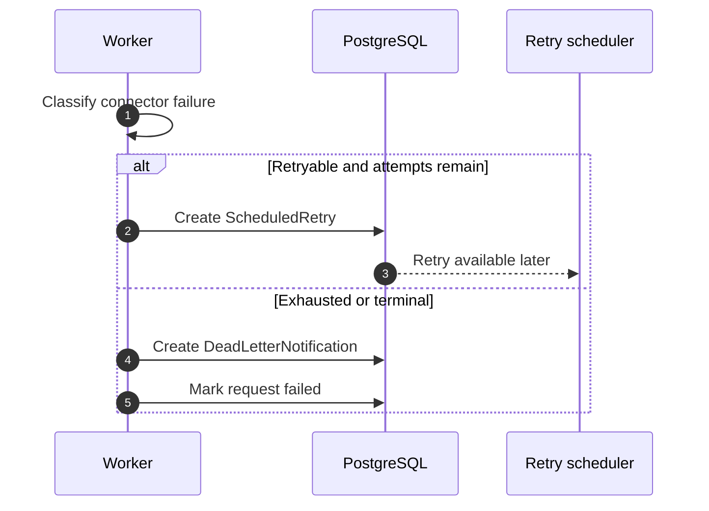
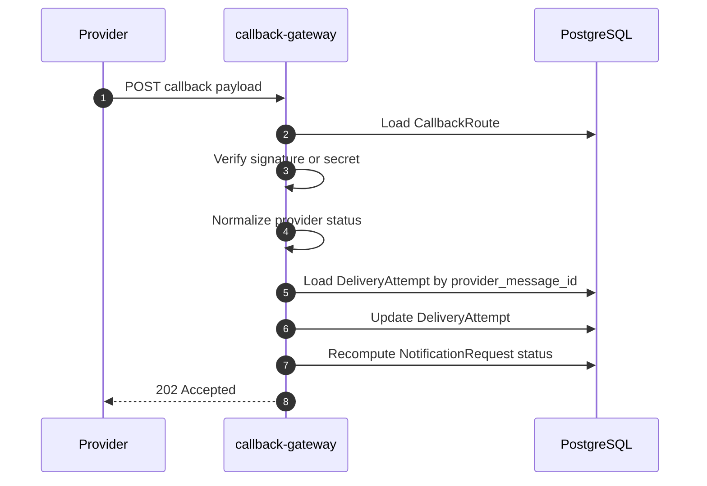
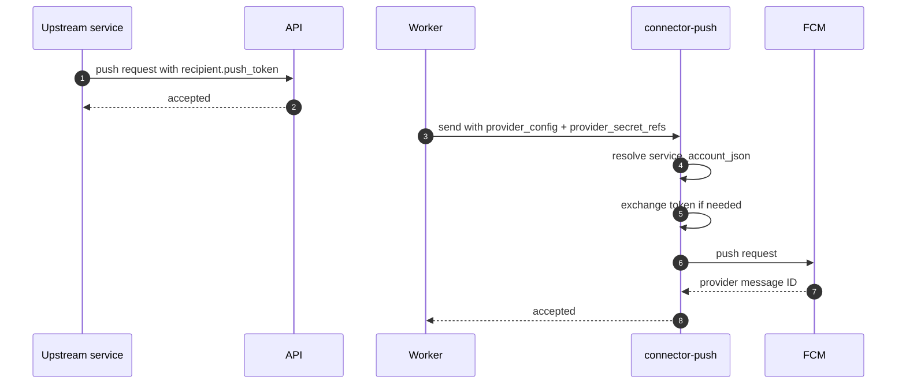
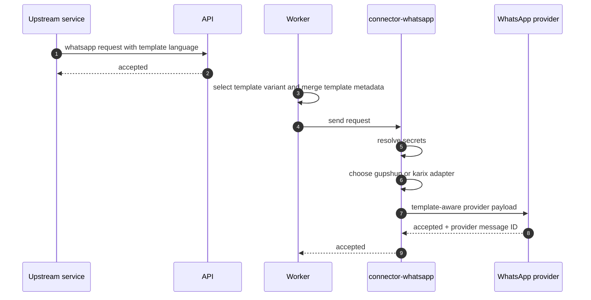
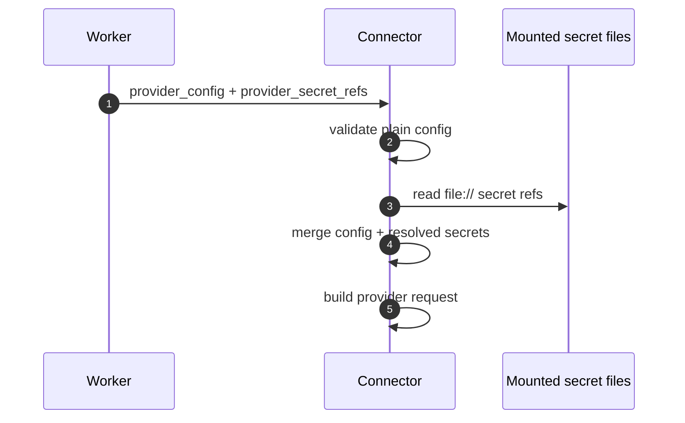

# Sequence Diagrams

This document collects the most important runtime sequences in one place.

## 1. New Notification Request

## 2. Worker Delivery Attempt

## 3. Retry Path

## 4. Callback Reconciliation

## 5. Push Delivery

## 6. WhatsApp Template Delivery

## 7. Managed Secret Resolution

