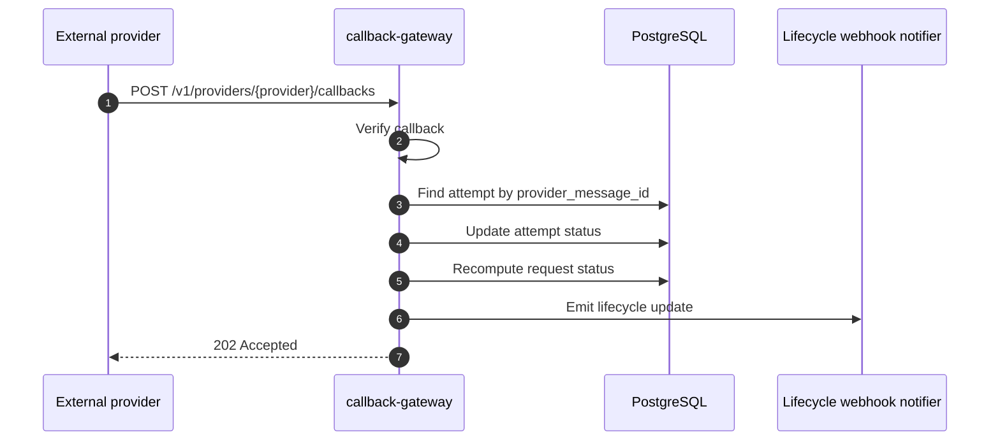

# Callbacks And Delivery Tracking

This guide shows how delivery tracking works after a provider accepts the outbound send.

## Callback Flow



## What Must Exist Before Callbacks Work

You need:

1. a provider account
2. a provider binding
3. a send that produced a `provider_message_id`
4. a callback route if the provider uses verified callbacks
5. the provider dashboard configured to point at the callback URL

## Step 1: Create A Callback Route

Example:

```bash
curl -s -X POST http://localhost:8080/v1/callback-routes \
  -H 'Content-Type: application/json' \
  -d '{
    "provider_key": "gupshup-whatsapp",
    "provider_account_id": "<provider_account_id>",
    "callback_path": "/v1/providers/gupshup-whatsapp/callbacks",
    "verification_mode": "shared_secret",
    "verification_secret_ref": {
      "ref": "file:///run/notification-secrets/gupshup_whatsapp_callback_secret.txt",
      "material_type": "secret_string",
      "source": "file"
    },
    "enabled": true
  }'
```

## Step 2: Configure The Provider Dashboard

Point the provider to the callback URL exposed by the control plane.

Example:

```text
https://<your-control-plane-domain>/v1/providers/gupshup-whatsapp/callbacks
```

If the provider uses a shared secret or signature:

- configure the same secret on the provider side
- store the matching secret reference in the callback route

## Channel Support Today

Current callback support in the codebase:

| Channel | Provider | Callback support |
|---|---|---|
| SMS | Gupshup | yes |
| SMS | Karix | yes |
| WhatsApp | Gupshup | yes |
| WhatsApp | Karix | yes |
| Email | SMTP | no provider callback |
| Email | SendGrid | not fully implemented end to end |
| Push | FCM | acceptance only, no callback reconciliation |
| Webhook | outbound target | not a provider-callback channel |

## What The Gateway Does

The callback gateway:

- receives provider-specific payloads
- optionally verifies callback authenticity
- normalizes provider statuses
- looks up the matching `delivery_attempt` by `provider_message_id`
- updates both the attempt and parent request

## Common Status Mapping

Examples:

- provider `SENT` -> accepted
- provider `DELIVERED` -> delivered
- provider `READ` -> delivered
- explicit failure or error -> failed

## How To Inspect Callback Results

Inspect the request:

```bash
curl -s http://localhost:8080/v1/notification-requests/<request_id>
```

Inspect the provider account status surface:

```bash
curl -s http://localhost:8080/v1/provider-accounts/<provider_account_id>/status
```

## Debug Checklist

If a message was accepted but not marked delivered:

1. confirm the provider returned a `provider_message_id`
2. confirm the callback route exists
3. confirm the provider dashboard points to the control plane callback URL
4. confirm the verification secret matches
5. inspect callback-gateway logs
6. confirm the callback payload contains the same provider message ID

## Example: Synthetic Verification Test

You can test the route manually before waiting for a real provider callback.

Example normalized envelope:

```bash
curl -s -X POST http://localhost:8082/v1/providers/gupshup-whatsapp/callbacks \
  -H 'Content-Type: application/json' \
  -H 'X-Callback-Secret: <shared_secret>' \
  -d '{
    "provider_message_id": "abc123",
    "status": "DELIVERED"
  }'
```

Use this only as a diagnostic aid. Real production tracking depends on real provider callbacks.
