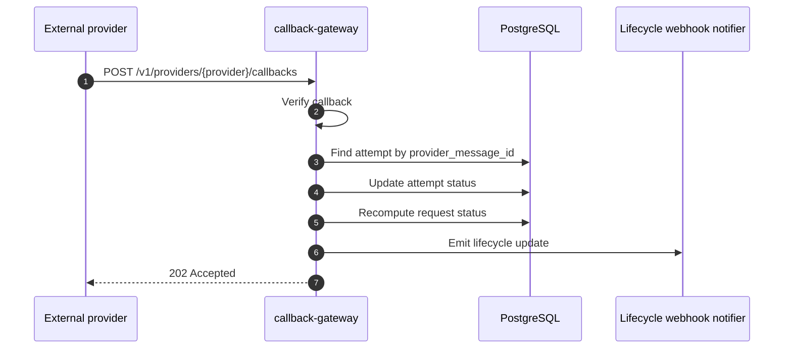

# Callbacks And Delivery Tracking

This guide shows how delivery tracking works after a provider accepts the outbound send.

## Callback Flow



## What Must Exist Before Callbacks Work

You need:

1. a provider account
2. a provider binding
3. a send that produced a `provider_message_id`
4. a callback route if the provider uses verified callbacks
5. the provider dashboard configured to point at the callback URL

## Generic Correlation Contract

The control plane is intentionally generic. It does not know about client-specific table keys or internal identifiers.

For lifecycle webhook consumers, the control plane sends:

- `request_id`: the control-plane request identifier
- `status`: the normalized request status
- `metadata`: the original request metadata plus callback context

If a downstream service needs to update its own tables, it should place its local correlation key in request metadata and read it back from the lifecycle webhook payload. Prefer one of these metadata keys:

- `correlation_id`
- `source_request_id`
- `source_reference_id`
- `reference_id`
- `request_id`

Recommended pattern for clients:

- store the client-local ID in request metadata before calling the control plane
- treat the control-plane `request_id` as the external notification ID
- keep provider callback secrets and verification state inside the control-plane callback gateway, not in the client service

## Verification Secret Handling

When the provider expects a shared secret or signature key, keep that secret out of the callback payload and out of the docs.

Store it as a file-backed secret reference and mount it into the callback gateway container.

Example shape:

```json
{
  "verification_mode": "shared_secret",
  "verification_secret_ref": {
    "ref": "file:///run/notification-secrets/provider_callback_secret.txt",
    "material_type": "secret_string",
    "source": "file"
  }
}
```

Practical rules:

- use the same secret value on the provider side and the control plane side
- mount the secret at runtime rather than hardcoding it in the image
- rotate the secret by updating the mounted secret and the provider dashboard together
- if the provider uses HMAC or another signature scheme, store the signing key the same way

## Step 1: Create A Callback Route

Example:

```bash
curl -s -X POST http://localhost:8080/v1/callback-routes \
  -H 'Content-Type: application/json' \
  -d '{
    "provider_key": "gupshup-whatsapp",
    "provider_account_id": "<provider_account_id>",
    "callback_path": "/v1/providers/gupshup-whatsapp/callbacks",
    "verification_mode": "shared_secret",
    "verification_secret_ref": {
      "ref": "file:///run/notification-secrets/gupshup_whatsapp_callback_secret.txt",
      "material_type": "secret_string",
      "source": "file"
    },
    "enabled": true
  }'
```

## Step 2: Configure The Provider Dashboard

Point the provider to the callback URL exposed by the control plane.

Example:

```text
https://<your-control-plane-domain>/v1/providers/gupshup-whatsapp/callbacks
```

If the provider uses a shared secret or signature:

- configure the same secret on the provider side
- store the matching secret reference in the callback route
- mount the secret into the callback gateway using the same file path referenced by the route

## Channel Support Today

Current callback support in the codebase:

| Channel | Provider | Callback support |
|---|---|---|
| SMS | Gupshup | yes |
| SMS | Karix | yes |
| WhatsApp | Gupshup | yes |
| WhatsApp | Karix | yes |
| Email | SMTP | no provider callback |
| Email | SendGrid | not fully implemented end to end |
| Push | FCM | acceptance only, no callback reconciliation |
| Webhook | outbound target | not a provider-callback channel |

## What The Gateway Does

The callback gateway:

- receives provider-specific payloads
- optionally verifies callback authenticity
- normalizes provider statuses
- looks up the matching `delivery_attempt` by `provider_message_id`
- updates both the attempt and parent request

## Common Status Mapping

Examples:

- provider `SENT` -> accepted
- provider `DELIVERED` -> delivered
- provider `READ` -> delivered
- explicit failure or error -> failed

## WhatsApp Inbound Replies

Delivery callbacks are not the same thing as inbound replies.

When a WhatsApp user replies to a business message:

1. the provider emits an inbound webhook
2. the callback gateway normalizes the provider payload
3. the control plane stores a generic `channel_event`
4. the control plane emits a `notification.channel_event.received` webhook to subscribed services

This is separate from the `notification.request.updated` lifecycle webhook used for delivery status updates.

Relevant provider payload examples:

- Gupshup inbound text/reply messages use the provider webhook shape documented for inbound messages and replies
- Karix WhatsApp inbound replies should be normalized into the same internal channel-event model

See [WhatsApp Inbound Replies](/docs/guides/whatsapp-inbound-replies.md) for the full flow.

## How To Inspect Callback Results

Inspect the request:

```bash
curl -s http://localhost:8080/v1/notification-requests/<request_id>
```

Inspect the provider account status surface:

```bash
curl -s http://localhost:8080/v1/provider-accounts/<provider_account_id>/status
```

## Debug Checklist

If a message was accepted but not marked delivered:

1. confirm the provider returned a `provider_message_id`
2. confirm the callback route exists
3. confirm the provider dashboard points to the control plane callback URL
4. confirm the verification secret matches
5. inspect callback-gateway logs
6. confirm the callback payload contains the same provider message ID

## Example: Synthetic Verification Test

You can test the route manually before waiting for a real provider callback.

Example normalized envelope:

```bash
curl -s -X POST http://localhost:8082/v1/providers/gupshup-whatsapp/callbacks \
  -H 'Content-Type: application/json' \
  -H 'X-Callback-Secret: <shared_secret>' \
  -d '{
    "provider_message_id": "abc123",
    "status": "DELIVERED"
  }'
```

Use this only as a diagnostic aid. Real production tracking depends on real provider callbacks.
