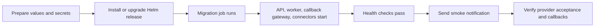

# Deploy The NotifyHub To Kubernetes

This guide shows the practical, step-by-step path for deploying the NotifyHub to Kubernetes.

It is written for operators who want to run the platform in a cluster, not just locally.

## What You Need Before You Start

1. A Kubernetes cluster.
2. `kubectl` access to that cluster.
3. `helm` installed locally.
4. A Postgres database reachable from the cluster.
5. A Kafka cluster reachable from the cluster.
6. Published container images for the API, worker, callback gateway, and connectors.
7. A Kubernetes Secret or ExternalSecret containing:
   - the admin API token
   - the read-only API token
   - provider credentials and callback verification secrets

## Recommended Deployment Order

1. Create the namespace.
2. Create the auth and provider secret resources.
3. Prepare the Helm values file.
4. Install or upgrade the release.
5. Wait for the migration job to finish.
6. Check pod readiness.
7. Run a smoke notification through one channel.
8. Verify callback handling if the channel supports it.

## High-Level Flow



## Step 1: Create The Namespace

```bash
kubectl create namespace notification-control-plane
```

If the namespace already exists, skip this step.

## Step 2: Create The Auth Secret

Store the admin and read tokens in a Kubernetes Secret or ExternalSecret.

Example Kubernetes Secret manifest:

```yaml
apiVersion: v1
kind: Secret
metadata:
  name: notification-control-plane-auth
  namespace: notification-control-plane
type: Opaque
stringData:
  admin-token: "<admin-token-placeholder>"
  read-token: "<read-token-placeholder>"
```

Important:
- use strong random values in production
- do not reuse local development tokens
- do not store real secret values in docs or Git

## Step 3: Create The Provider Secret Secret

Provider credentials should be mounted or injected as files inside the connector pods.

Example secret for file-backed provider material:

```yaml
apiVersion: v1
kind: Secret
metadata:
  name: notification-control-plane-secrets
  namespace: notification-control-plane
type: Opaque
stringData:
  firebase_service_account.json: "<service-account-json-placeholder>"
  gupshup_whatsapp_password: "<gupshup-whatsapp-password-placeholder>"
  gupshup_sms_username: "<gupshup-sms-username-placeholder>"
  gupshup_sms_password: "<gupshup-sms-password-placeholder>"
  smtp_password: "<smtp-password-placeholder>"
  gupshup_whatsapp_callback_secret: "<callback-secret-placeholder>"
  gupshup_sms_callback_secret: "<callback-secret-placeholder>"
```

A real cluster may source these values from:
- External Secrets
- Kubernetes Secrets created by your secrets manager
- CSI secret stores
- sealed secrets

If a provider uses callback verification, keep the verification secret in the same mounted secret store and reference it by file path in the account-specific callback route.

## Step 4: Prepare The Helm Values File

Create a `values.prod.yaml` or `values.stage.yaml` file.

Example skeleton:

```yaml
global:
  appEnv: production
  appVersion: "1.0.0"

images:
  api:
    repository: ghcr.io/your-org/notification-control-plane/api
    tag: "1.0.0"
  worker:
    repository: ghcr.io/your-org/notification-control-plane/worker
    tag: "1.0.0"
  callbackGateway:
    repository: ghcr.io/your-org/notification-control-plane/callback-gateway
    tag: "1.0.0"

auth:
  existingSecret: notification-control-plane-auth

database:
  url: "postgres://<user>:<password>@<postgres-host>:5432/notification_control_plane?sslmode=require"

kafka:
  brokers:
    - "kafka-1:9092"
    - "kafka-2:9092"

secrets:
  existingSecret: notification-control-plane-secrets
```

Keep environment-specific values out of the chart itself. Only the values file should change per environment.

## Step 5: Install Or Upgrade The Release

```bash
helm upgrade --install notification-control-plane deployments/helm/notification-control-plane \
  --namespace notification-control-plane \
  --create-namespace \
  -f values.prod.yaml
```

If you use a separate file for production overrides, make sure it contains only environment-specific settings.

## Step 6: Wait For The Migration Job

The chart includes a pre-install / pre-upgrade migration job.

Check the job status:

```bash
kubectl -n notification-control-plane get jobs
```

If the migration job fails:
- inspect the job logs
- fix the schema issue or configuration mismatch
- re-run the Helm upgrade after the issue is corrected

## Step 7: Check Pod Readiness

```bash
kubectl -n notification-control-plane get pods
```

You want the following to be ready:
- `api`
- `worker`
- `callback-gateway`
- `connector-email`
- `connector-sms`
- `connector-webhook`
- `connector-push`
- `connector-whatsapp`

Also confirm the services exist:

```bash
kubectl -n notification-control-plane get svc
```

## Step 8: Verify Health Endpoints

Check the API health endpoint through your ingress or service endpoint.

Example:

```bash
curl -s https://<control-plane-host>/healthz
```

If you expose the worker health endpoint, check it as well.

## Step 9: Run A Smoke Notification

Pick one channel that is already configured and send a simple smoke test.

Example for email:

```bash
curl -s -X POST https://<control-plane-host>/v1/notification-requests \
  -H 'Content-Type: application/json' \
  -H 'Authorization: Bearer <client-api-key>' \
  -d '{
    "idempotency_key": "smoke-email-001",
    "event_name": "smoke.test.email",
    "template_key": "smoke-email-v1",
    "language_code": "en",
    "channels": ["email"],
    "recipient": {
      "user_id": "smoke-user-1",
      "email": "recipient@example.com"
    },
    "variables": {
      "subject": "Smoke test",
      "body": "This is a production smoke test."
    }
  }'
```

Use your own test recipient and real provider setup.

## Step 10: Verify The Result

Check the request status:

```bash
curl -s https://<control-plane-host>/v1/notification-requests/<request_id>
```

Look for:
- request acceptance
- delivery attempt creation
- provider message ID
- delivered or accepted state depending on the channel

## Step 11: Configure Provider Callbacks

If the channel supports delivery receipts or verified callbacks, point the provider dashboard at the callback gateway before you call the deployment done.

Typical callback URL shape:

```text
https://<control-plane-host>/v1/providers/<provider-key>/<provider-account-id>/callbacks
```

Examples:
- `gupshup-whatsapp`
- `gupshup-sms`
- `karix-sms`
- `karix-whatsapp` if you enable it

Then confirm:

1. the callback route exists in the control plane
2. the provider dashboard is sending events to the callback URL
3. the verification secret matches on both sides, if verification is enabled
4. the request transitions from accepted to delivered or failed after the callback arrives

Use [Callbacks And Delivery Tracking](/docs/guides/callbacks-and-delivery-tracking.md) for the exact callback route model and verification flow.

## Step 12: Roll Back If Needed

If the app version is bad, use Helm rollback:

```bash
helm rollback notification-control-plane <revision>
```

Important:
- rollback the application code with Helm
- do not try to undo a schema migration manually in production unless you have a very controlled database rollback plan
- prefer forward-only schema changes and a corrected follow-up release

## Production Checklist

Before you declare the release complete:

- the migration job succeeded
- all pods are ready
- the API health endpoint is green
- at least one smoke notification succeeded
- callback tracking works for supported channels
- metrics are visible in Prometheus and Grafana
- logs are readable and searchable
- the secrets mount is in place for all provider connectors

## Related Channel Setup

After the cluster is deployed, follow the channel-specific checklist in [Channel Setup Checklist](/docs/guides/channel-setup-checklist.md).
