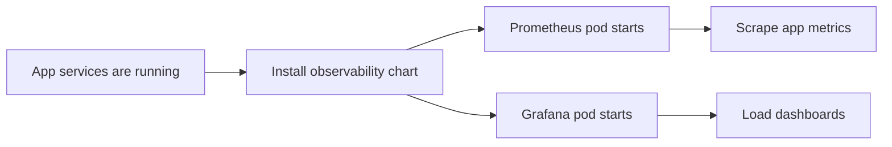

# Deploy The Observability Stack

This guide shows how to deploy the NotifyHub observability stack into Kubernetes using a three-namespace layout:

- `platform` for the NotifyHub app
- `metrics` for Prometheus, Grafana, and cAdvisor
- `exporters` for Postgres and Kafka exporters

It installs:

- Prometheus
- Grafana
- cAdvisor
- Postgres exporter
- Kafka exporter
- the NotifyHub dashboards
- Prometheus alert rules
- a Grafana alerting dashboard

This stack is separate from the application Helm chart so you can upgrade monitoring independently.

## What The Stack Monitors

Out of the box, Prometheus scrapes:

- API
- worker
- callback gateway
- email connector
- SMS connector
- webhook connector
- push connector
- WhatsApp connector

It can also scrape extra targets if you add them later.

## What You Need Before You Start

1. A Kubernetes cluster.
2. `kubectl` access to that cluster.
3. `helm` installed locally.
4. The NotifyHub app chart already deployed in the `platform` namespace, or at least the app services available there.
5. The `exporters` namespace has a Postgres DSN secret.

## Recommended Order

1. Deploy the app chart into `platform`.
2. Deploy the observability chart into `metrics`.
3. Create the exporter secret and deploy the exporter workloads into `exporters`.
4. Confirm Prometheus can scrape the app services and exporter pods.
5. Open Grafana and validate the dashboards.

## Deployment Flow



## Step 1: Prepare Values

Create a values file for observability, for example `values.observability.yaml`.
For the checked-in local split, you can also use:

- `deployments/helm/notification-control-plane/values.platform-local.yaml`
- `deployments/helm/notification-control-plane-observability/values.platform-local.yaml`

Example:

```yaml
global:
  appEnv: production

appReleaseName: notification-control-plane
appNamespace: platform
exportersNamespace: exporters

postgresExporter:
  existingSecret: notification-control-plane-observability-postgres-dsn
  existingSecretKey: data-source-name

kafkaExporter:
  brokersCSV: local-kafka.notification-control-plane.svc.cluster.local:9092

grafana:
  adminUser: admin
  adminPassword: "<admin-password-placeholder>"
```

Use a strong random password in production and store it in a secret manager.

## Step 1a: Create The Postgres Exporter Secret

The Postgres exporter needs a DSN so it can scrape database metrics.

Example Kubernetes Secret:

```yaml
apiVersion: v1
kind: Secret
metadata:
  name: notification-control-plane-observability-postgres-dsn
  namespace: exporters
type: Opaque
stringData:
  data-source-name: "postgresql://<user>:<password>@local-postgresql.notification-control-plane.svc.cluster.local:5432/notification_control_plane?sslmode=disable"
```

Keep this value out of Git and store the real DSN in your cluster secret manager.

If your app release uses secret-backed env vars for email, create a companion secret in `platform` for the email connector and reference it from the app values under `connectors.definitions[].envFromSecret`.

## Step 2: Install The Chart

```bash
helm upgrade --install notification-control-plane-observability deployments/helm/notification-control-plane-observability \
  --namespace metrics \
  --create-namespace \
  -f values.observability.yaml
```

## Step 3: Check The Pods

```bash
kubectl -n metrics get pods
```

You should see at least:

- Prometheus
- Grafana
- cAdvisor pods, one per node
- Postgres exporter
- Kafka exporter

If a pod is not ready, inspect the logs first.

## Step 4: Verify Prometheus

Port-forward Prometheus:

```bash
kubectl -n metrics port-forward svc/notification-control-plane-observability-prometheus 9090:9090
```

Open:

```text
http://localhost:9090
```

Check targets and confirm:

- the NotifyHub services are visible
- the Postgres exporter target is healthy
- the Kafka exporter target is healthy

## Step 5: Verify Grafana

Port-forward Grafana:

```bash
kubectl -n notification-control-plane port-forward svc/notification-control-plane-observability-grafana 3000:3000
```

Open:

```text
http://localhost:3000
```

Use the admin credentials from the Grafana secret.

Confirm the dashboards load:

- NotifyHub overview
- NotifyHub load test
- NotifyHub Alerts

The load-test dashboard now includes cAdvisor process CPU and memory panels, so you can see the monitoring pod itself in Grafana as well as the application services.

## Step 6: Validate Scrapes

In Prometheus, check the targets page and make sure the app services are up.

If you do not see the app pods as targets:

1. confirm the app chart is deployed in the same namespace
2. confirm the service names match the scrape targets
3. adjust `appReleaseName` if the app release name is different
4. confirm the exporter secret and Kafka broker string are set
5. confirm the app services are reachable across namespaces through FQDNs

## Step 7: Add Optional Exporters Later

If you want additional exporters beyond the built-in cAdvisor, Postgres exporter, and Kafka exporter, deploy them separately and then add their targets to the Prometheus values.

Common optional exporters:

- cAdvisor
- PostgreSQL exporter
- Kafka exporter

Keep them separate if your platform team already manages those services elsewhere.

This chart already includes the cAdvisor pod, the Postgres exporter, the Kafka exporter, and a Grafana dashboard for alert state.

If you want the exporter pods in this chart, keep the Postgres DSN in a mounted Kubernetes Secret in the `exporters` namespace and provide the Kafka bootstrap string in the values file.

## Step 8: Roll Back

If the observability release is wrong, roll back the Helm revision:

```bash
helm rollback notification-control-plane-observability <revision>
```

## Related Docs

- [Deploy The NotifyHub To Kubernetes](/docs/guides/deploy-control-plane-to-kubernetes.md)
- [Callbacks And Delivery Tracking](/docs/guides/callbacks-and-delivery-tracking.md)
- [Channel Setup Checklist](/docs/guides/channel-setup-checklist.md)
