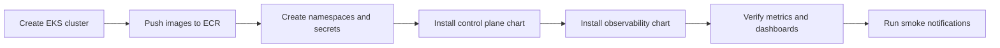

# Deploy To AWS EKS

This guide shows how to deploy the NotifyHub to a fresh Amazon EKS cluster in a production-shaped way.

It assumes a three-namespace layout:

- `platform` for the control plane app
- `metrics` for Prometheus, Grafana, and cAdvisor
- `exporters` for Postgres and Kafka exporters

## What You Need Before You Start

1. AWS credentials with permission to create EKS, ECR, IAM, EC2 networking, and Kubernetes resources.
2. `aws`, `eksctl`, `kubectl`, `helm`, and `docker` installed locally.
3. A target AWS region. This guide uses `ap-south-1`.
4. A fresh EKS cluster or permission to create one.
5. A reachable Postgres database URL for the control plane, ideally from Amazon RDS PostgreSQL.
6. A reachable Kafka broker list for the control plane, ideally from Amazon MSK.
7. A Kubernetes secret source for provider credentials and callback verification secrets.

If you do not yet have Postgres or Kafka in AWS, deploy or provision them first. The control plane requires both.

## Recommended Deployment Order

1. Create the EKS cluster.
2. Push application images to ECR.
3. Create the `platform`, `metrics`, and `exporters` namespaces.
4. Create the auth secret and the provider secret volume.
5. Install the control plane chart into `platform`.
6. Install the observability chart into `metrics` and `exporters`.
7. Verify Prometheus targets and Grafana dashboards.
8. Run a smoke notification through each supported channel.

## High-Level Flow



## Step 1: Create The EKS Cluster

Create a fresh EKS cluster in `ap-south-1` using `eksctl`.

Example:

```bash
AWS_PROFILE=<aws-profile> eksctl create cluster \
  --name notification-control-plane-prod \
  --region ap-south-1 \
  --managed \
  --nodegroup-name platform-nodes \
  --node-type t3.medium \
  --nodes 2 \
  --nodes-min 2 \
  --nodes-max 4 \
  --with-oidc
```

The cluster should be created with at least two availability zones where possible.
For the first AWS rollout, this guide uses a smaller `t3.medium` managed node group.

## Step 2: Push Images To ECR

The app chart expects container images to come from a registry that your EKS nodes can pull from.

Build and push the control plane images to ECR:

- `api`
- `worker`
- `callback-gateway`
- `migrate`
- `connector-email`
- `connector-sms`
- `connector-webhook`
- `connector-push`
- `connector-whatsapp`

The observability chart uses public images for Prometheus, Grafana, cAdvisor, Postgres exporter, and Kafka exporter.

If you want to provision the managed data layer in the same AWS account, use:

```bash
scripts/aws/provision-managed-data.sh
```

That script creates:

- a private RDS PostgreSQL instance
- a provisioned Amazon MSK cluster with unauthenticated VPC access
- the security groups and subnet group needed for both

It prints the `DATABASE_URL` and `KAFKA_BROKERS` values you should feed into the AWS Helm values files.

## Step 3: Create Namespaces

Create the runtime namespaces:

```bash
kubectl create namespace platform
kubectl create namespace metrics
kubectl create namespace exporters
```

## Step 4: Create Secrets

Create an auth secret in `platform` with:

- an admin token
- a read-only token

Create a mounted secret volume in `platform` containing the provider and callback verification files that the connectors expect.

The secret files should be mounted at:

```text
/run/notification-secrets
```

Example file names:

- `firebase_service_account.json`
- `smtp_user.txt`
- `smtp_password.txt`
- `sms_username.txt`
- `sms_password.txt`
- `whatsapp_password.txt`
- `gupshup_whatsapp_callback_secret.txt`
- `gupshup_sms_callback_secret.txt`
- `provider_callback_secret.txt`

Do not commit the real contents of these files to Git.

## Step 5: Install The Control Plane Chart

Install the chart into `platform` with values that point at your ECR image repository and the real database and Kafka endpoints.

Example:

```bash
helm upgrade --install notification-control-plane deployments/helm/notification-control-plane \
  --namespace platform \
  --create-namespace \
  -f deployments/helm/notification-control-plane/values.aws.yaml
```

The API rate limiter is also configured through values so you can tune it without code changes.
The default AWS values enable it with a conservative baseline:

- anonymous/IP protection before authentication
- per-client request limits after authentication
- separate read and admin limits for protected endpoints

If you need to adjust the defaults, edit these values in the chart or in your AWS override file:

- `api.rateLimit.enabled`
- `api.rateLimit.anonymousRPS`
- `api.rateLimit.anonymousBurst`
- `api.rateLimit.clientRPS`
- `api.rateLimit.clientBurst`
- `api.rateLimit.readRPS`
- `api.rateLimit.readBurst`
- `api.rateLimit.adminRPS`
- `api.rateLimit.adminBurst`
- `api.rateLimit.cleanupInterval`
- `api.rateLimit.entryTTL`

The corresponding environment variables are prefixed with `NOTIFICATION_RATE_LIMIT_`.

## Step 6: Install The Observability Chart

Install the observability chart into `metrics`.

The chart should scrape:

- the app services in `platform`
- Postgres exporter in `exporters`
- Kafka exporter in `exporters`
- cAdvisor in `metrics`

Example:

```bash
helm upgrade --install notification-control-plane-observability deployments/helm/notification-control-plane-observability \
  --namespace metrics \
  --create-namespace \
  -f deployments/helm/notification-control-plane-observability/values.aws.yaml
```

## Step 7: Verify The Cluster

Check that the pods are running:

```bash
kubectl -n platform get pods
kubectl -n metrics get pods
kubectl -n exporters get pods
```

Then verify:

- API health
- worker health
- callback gateway health
- connector readiness
- Prometheus targets
- Grafana dashboard provisioning

## Step 8: Run A Smoke Notification

Send one notification per supported channel:

- email
- SMS
- WhatsApp
- push

Use real templates and provider accounts that are already approved in the target environment.
For production, keep Postgres and Kafka outside the app namespace. Use Amazon RDS PostgreSQL and Amazon MSK, then feed their connection details into the AWS values files.

For channels with callbacks enabled, make sure the provider dashboard is configured to call the callback route exposed by the control plane.

## Step 9: Roll Back If Needed

If either chart deploys incorrectly, roll back the Helm release:

```bash
helm rollback notification-control-plane <revision>
helm rollback notification-control-plane-observability <revision>
```

## Notes

- This guide intentionally does not include real secret values.
- If you want a single command to build images, seed namespaces, and install both charts, use the AWS deploy helper script in `scripts/aws/deploy-eks.sh` once your database and Kafka endpoints are available.
- For day-2 commands to resume, stop, or tear down the AWS environment, use [AWS Operations Runbook](/docs/guides/aws-operations-runbook.md).
