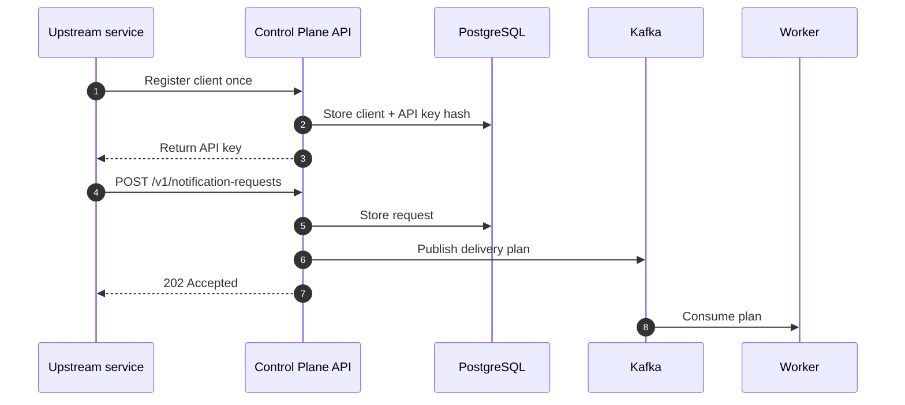

# Onboard An Upstream Service

This guide shows how any upstream application can start sending notifications through the control plane.

Examples of upstream services:

- `communication-engine`
- `billing-service`
- `ops-service`
- `afs-admin-service`

The integration is generic. The upstream service does not need to know provider-specific APIs.

## What The Upstream Service Owns

The upstream service owns:

- the business event
- the recipient identity
- the template key
- the variables for rendering
- the requested channel or channels

The control plane owns:

- request persistence
- routing
- provider selection
- retries
- dead letters
- callback reconciliation
- metrics and auditing

## Upstream Integration Flow



## Step 1: Create A Notification Client

Each upstream service should have its own client identity.

Example:

```bash
curl -s -X POST http://localhost:8080/v1/clients \
  -H 'Content-Type: application/json' \
  -d '{
    "tenant_id": "tenant-a",
    "client_name": "billing-service",
    "allowed_channels": ["email", "sms", "whatsapp", "push", "webhook"],
    "enabled": true
  }'
```

The response includes:

- `client.client_id`
- `client.tenant_id`
- `client.client_name`
- `api_key`

Store the returned `api_key` securely. The raw API key is only returned once.

## Step 2: Use The API Key On Requests

Every notification request should include:

```text
Authorization: Bearer <api_key>
```

Example:

```bash
curl -s -X POST http://localhost:8080/v1/notification-requests \
  -H 'Content-Type: application/json' \
  -H 'Authorization: Bearer <api_key>' \
  -d '{
    "idempotency_key": "billing-reminder-001",
    "event_name": "billing.payment_due",
    "template_key": "billing-payment-due-v1",
    "channels": ["email"],
    "recipient": {
      "user_id": "user-123",
      "email": "user@example.com"
    },
    "variables": {
      "name": "Ravi",
      "amount": "499",
      "due_date": "2026-06-15"
    }
  }'
```

## Step 3: Understand The Request Rules

The request must include:

- `idempotency_key`
- `event_name`
- `template_key`
- at least one channel
- a recipient with the right destination field for the channel

The request must not include:

- provider credentials
- provider account IDs
- secret references
- provider-specific REST payloads

## Channel Destination Rules

Use the recipient field that matches the channel:

- email -> `recipient.email`
- sms -> `recipient.phone`
- whatsapp -> `recipient.phone`
- push -> `recipient.push_token` or `recipient.topic`
- webhook -> `recipient.webhook`

## Step 4: Use Idempotency Correctly

The control plane enforces idempotency by `idempotency_key`.

If the same service sends the same key again with the same intent:

- the API returns the existing request
- no duplicate notification is created

If the same key is reused with different intent:

- the API returns a conflict

Recommended pattern:

```text
<service>-<business-event>-<business-entity>-<sequence>
```

Example:

```text
billing-payment_due-invoice_4387-01
```

## Step 5: Inspect The Created Request

Use the returned `request_id`:

```bash
curl -s http://localhost:8080/v1/notification-requests/<request_id>
```

This view shows:

- the canonical request
- delivery attempts
- scheduled retries
- dead letters
- lifecycle status

## Example: Generic Multi-Channel Upstream Request

```json
{
  "idempotency_key": "ops-alert-0007",
  "event_name": "ops.node.health.degraded",
  "template_key": "ops-node-health-v1",
  "channels": ["email", "sms", "whatsapp"],
  "binding_set": "ops-critical",
  "recipient": {
    "user_id": "ops-user-17",
    "email": "ops@example.com",
    "phone": "+919999999999"
  },
  "variables": {
    "service": "inventory",
    "cluster": "prod-west",
    "status": "degraded"
  },
  "metadata": {
    "severity": "critical"
  },
  "priority": "high"
}
```

## Summary

The upstream service integration should stay simple:

1. register a client once
2. keep the API key secure
3. send canonical notification requests
4. let the control plane own delivery mechanics
