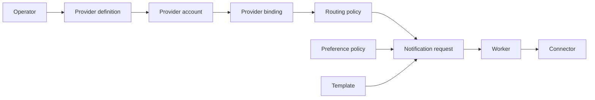

# Onboard Provider Accounts And Bindings

This guide shows how to connect real delivery providers to the Notification Control Plane.

This is the heart of the managed-provider model.

Provider-account, binding, routing, template, preference, delivery, callback-route, and dead-letter write calls require the `X-Notification-Admin-Token` header. In the default local stack, the token is `integration-admin-token`.

Read-only config and status endpoints accept either `X-Notification-Read-Token` or `X-Notification-Admin-Token`. In the default local stack, the read token is `integration-read-token`.

## Concepts First

### Provider Definition

A provider definition is the platform-owned catalog entry for a supported provider.

Examples:

- `smtp-email`
- `sendgrid-email`
- `gupshup-sms`
- `karix-sms`
- `gupshup-whatsapp`
- `karix-whatsapp`
- `fcm-push`

### Provider Account

A provider account is a tenant-specific configured instance of a provider.

It contains:

- tenant identity
- provider key
- non-secret config
- typed secret references

### Provider Binding

A provider binding tells the worker which connector endpoint and provider account to use for a channel and binding set.

### Routing Policy

A routing policy maps a business event to channels and, optionally, a binding set.

## Provider Onboarding Flow



## Step 1: Inspect Supported Providers

```bash
curl -s http://localhost:8080/v1/provider-definitions
```

This tells you:

- supported `provider_key`
- channel
- connector name
- required config shape
- callback mode

## Step 2: Register A Provider Account

Example for SMTP email:

```bash
curl -s -X POST http://localhost:8080/v1/provider-accounts \
  -H 'Content-Type: application/json' \
  -d '{
    "tenant_id": "tenant-a",
    "provider_key": "smtp-email",
    "display_name": "Tenant A SMTP",
    "channel": "email",
    "enabled": true,
    "config": {
      "host": "smtp.gmail.com",
      "port": "587",
      "from_email": "noreply@example.com"
    },
    "secret_refs": {
      "user": {
        "ref": "file:///run/notification-secrets/ce_email_smtp_user.txt",
        "material_type": "secret_string",
        "source": "file"
      },
      "password": {
        "ref": "file:///run/notification-secrets/ce_email_smtp_password.txt",
        "material_type": "secret_string",
        "source": "file"
      }
    }
  }'
```

Example for FCM push:

```bash
curl -s -X POST http://localhost:8080/v1/provider-accounts \
  -H 'Content-Type: application/json' \
  -d '{
    "tenant_id": "tenant-a",
    "provider_key": "fcm-push",
    "display_name": "Tenant A FCM",
    "channel": "push",
    "enabled": true,
    "config": {
      "project_id": "nurture-farm"
    },
    "secret_refs": {
      "service_account_json": {
        "ref": "file:///run/notification-secrets/farm_fcm_content_adminsdk.json",
        "material_type": "secret_json",
        "source": "file"
      }
    }
  }'
```

## Secret Material Types

Supported material types:

- `plain_string`
- `secret_string`
- `secret_json`
- `secret_file`

Current production-shaped local pattern:

- plain config lives in `config`
- secrets live in `secret_refs`
- connectors resolve secret refs at runtime

## Step 3: Create A Provider Binding

Example:

```bash
curl -s -X POST http://localhost:8080/v1/provider-bindings \
  -H 'Content-Type: application/json' \
  -d '{
    "channel": "email",
    "binding_set": "tenant-a-default",
    "provider_account_id": "<provider_account_id>",
    "endpoint_url": "http://connector-email:8091",
    "enabled": true,
    "priority": 10
  }'
```

Important:

- `provider_account_id` is required
- the legacy `config_refs` path is gone
- bindings are now fully managed-provider bindings

## Step 4: Create Routing

Example:

```bash
curl -s -X POST http://localhost:8080/v1/routing-policies \
  -H 'Content-Type: application/json' \
  -d '{
    "event_name": "billing.payment_due",
    "channels": ["email"],
    "binding_set": "tenant-a-default",
    "enabled": true,
    "priority": 10
  }'
```

## Step 5: Create Preferences

Example:

```bash
curl -s -X POST http://localhost:8080/v1/preference-policies \
  -H 'Content-Type: application/json' \
  -d '{
    "user_id": "user-123",
    "channel": "email",
    "is_enabled": true
  }'
```

## Step 6: Create Templates

Example:

```bash
curl -s -X POST http://localhost:8080/v1/templates \
  -H 'Content-Type: application/json' \
  -d '{
    "template_key": "billing-payment-due-v1",
    "language_code": "en",
    "channel": "email",
    "subject_template": "Payment due for {{name}}",
    "body_template": "Hello {{name}}, your payment of {{amount}} is due on {{due_date}}.",
    "metadata": {
      "use_case": "billing"
    },
    "enabled": true
  }'
```

Multi-language templates use the same `template_key` and channel, but a different `language_code`.

Example:

```bash
curl -s -X POST http://localhost:8080/v1/templates \
  -H 'Content-Type: application/json' \
  -d '{
    "template_key": "billing-payment-due-v1",
    "language_code": "hi-in",
    "channel": "email",
    "subject_template": "{{name}} के लिए भुगतान देय है",
    "body_template": "नमस्ते {{name}}, आपका {{amount}} का भुगतान {{due_date}} को देय है.",
    "metadata": {
      "use_case": "billing"
    },
    "enabled": true
  }'
```

If `language_code` is omitted, the control plane stores and uses `en` by default.

If you want the same template in another language, create another template row with the same `template_key`, the same channel, and a different `language_code`.

## Multi-Provider Pattern

A single channel can have multiple provider bindings.

Example SMS pool:

- `gupshup-sms` binding, priority `10`
- `karix-sms` binding, priority `20`

That allows:

- ordered provider selection
- failover when one provider is unhealthy
- event-specific binding sets

## Example: SMS Provider Account Variants

`gupshup-sms` supports more than one config shape.

Variant 1:

```json
{
  "config": {
    "sender_id": "NURTUR",
    "base_url": "https://enterprise.smsgupshup.com"
  },
  "secret_refs": {
    "api_key": {
      "ref": "file:///run/notification-secrets/gupshup_api_key.txt",
      "material_type": "secret_string",
      "source": "file"
    }
  }
}
```

Variant 2:

```json
{
  "config": {
    "sender_id": "NURTUR",
    "base_url": "https://enterprise.smsgupshup.com"
  },
  "secret_refs": {
    "username": {
      "ref": "file:///run/notification-secrets/ce_gupshup_sms_username.txt",
      "material_type": "secret_string",
      "source": "file"
    },
    "password": {
      "ref": "file:///run/notification-secrets/ce_gupshup_sms_password.txt",
      "material_type": "secret_string",
      "source": "file"
    }
  }
}
```

## Summary

Provider onboarding is a six-step path:

1. inspect provider definitions
2. create a provider account
3. create a provider binding
4. create routing
5. create preferences
6. create templates
