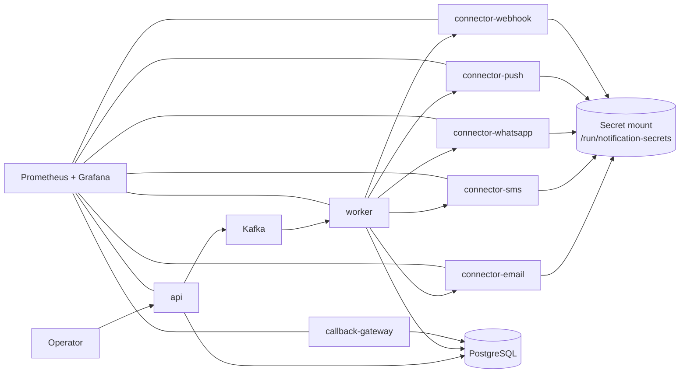

# Run The Platform

This guide shows how to run the Notification Control Plane locally in the same production-shaped model used by the current codebase.

## What Runs In The Local Stack

The local stack contains:

- `api`
- `worker`
- `callback-gateway`
- `connector-email`
- `connector-sms`
- `connector-whatsapp`
- `connector-push`
- `connector-webhook`
- PostgreSQL
- Kafka
- Prometheus
- Grafana
- Kafka UI
- Adminer

## Runtime Topology



## Step 1: Prepare Local Secrets

The current production-shaped local runtime expects provider secrets to be mounted into the connector containers at:

```text
/run/notification-secrets
```

By default, Docker Compose mounts this host directory:

```text
/tmp/notification-control-plane-secrets
```

Create it if needed:

```bash
mkdir -p /tmp/notification-control-plane-secrets
```

Put only the files you need there. Common examples:

- `farm_fcm_content_adminsdk.json`
- `afs_admin_fcm_content_adminsdk.json`
- `ce_email_smtp_user.txt`
- `ce_email_smtp_password.txt`
- `ce_gupshup_sms_username.txt`
- `ce_gupshup_sms_password.txt`
- `ce_gupshup_whatsapp_password.txt`

Do not commit these files into git.

The admin/config write surface is protected with `X-Notification-Admin-Token`. In the default local stack, the token is `integration-admin-token`, and the same value is wired into Docker Compose for local runs.

Read-only config/status GETs can use `X-Notification-Read-Token` or the admin token. In the default local stack, the read token is `integration-read-token`, and it is also wired into Docker Compose for local runs.

## Step 2: Start The Stack

```bash
make up
```

If you need a fresh schema migration run:

```bash
make migrate
```

Stop the stack:

```bash
make down
```

## Step 3: Verify Service Health

Check Docker services:

```bash
docker compose -f deployments/docker/compose.yml ps
```

Check API health:

```bash
curl -s http://localhost:8080/healthz
```

Check worker health:

```bash
curl -s http://localhost:8081/healthz
```

Check callback gateway health:

```bash
curl -s http://localhost:8082/healthz
```

## Local URLs

- API: `http://localhost:8080`
- Worker: `http://localhost:8081`
- Callback gateway: `http://localhost:8082`
- Email connector: `http://localhost:8091`
- SMS connector: `http://localhost:8092`
- Webhook connector: `http://localhost:8093`
- Push connector: `http://localhost:8094`
- WhatsApp connector: `http://localhost:8095`
- Kafka UI: `http://localhost:8085`
- Adminer: `http://localhost:8086`
- Prometheus: `http://localhost:9090`
- Grafana: `http://localhost:3000`

## Default Local Credentials

### PostgreSQL

- host: `localhost`
- port: `5433`
- user: `postgres`
- password: `postgres`
- database: `notification_control_plane`

### Grafana

- user: `admin`
- password: `admin`

## Expected Startup Behavior

The healthy path is:

1. migrations run
2. API starts
3. connectors start
4. worker starts and begins consuming Kafka
5. Prometheus starts scraping all services
6. Grafana dashboards become usable

## Production-Shaped Secret Pattern

This repo now uses the same pattern across managed providers:

- secret references are stored in provider accounts
- worker passes `provider_config` and `provider_secret_refs`
- connectors resolve secret values at send time
- secret files are mounted read-only into connectors

That means:

- worker does not need direct access to provider secret files
- connector containers are the secret-consumer boundary
- file-backed secrets behave the same way as mounted production secrets

## Useful Checks

See configured provider bindings:

```bash
curl -s http://localhost:8080/v1/provider-bindings
```

See provider definitions:

```bash
curl -s http://localhost:8080/v1/provider-definitions
```

See Prometheus targets:

```bash
curl -s http://localhost:9090/api/v1/targets
```
