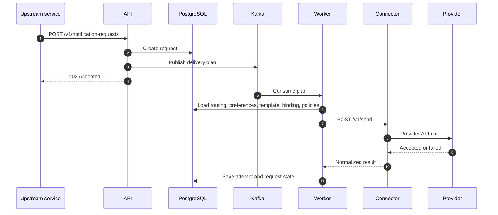

# Send Notifications

This guide shows how to send notifications once the platform and provider accounts are already configured.

## End-To-End Send Flow



## Request Shape

Every notification request is canonical.

Core fields:

- `idempotency_key`
- `event_name`
- `template_key`
- `language_code` if you want a non-English template variant
- `channels`
- `recipient`
- `variables`
- optional `metadata`
- optional `binding_set`
- optional `priority`
- optional `expires_at`

## Language Selection

The control plane uses `language_code` to choose the template variant.

- if `language_code` is omitted, the request defaults to English
- if a requested language variant is missing, the worker falls back to English
- if English is also missing, the request fails template lookup for that channel

## Email Example

```bash
curl -s -X POST http://localhost:8080/v1/notification-requests \
  -H 'Content-Type: application/json' \
  -H 'Authorization: Bearer <api_key>' \
  -d '{
    "idempotency_key": "email-001",
    "event_name": "customer.invoice.ready",
    "template_key": "invoice-ready-email-v1",
    "language_code": "en",
    "channels": ["email"],
    "recipient": {
      "user_id": "cust-1",
      "email": "customer@example.com"
    },
    "variables": {
      "name": "Asha",
      "invoice_id": "INV-1001"
    }
  }'
```

## SMS Example

```bash
curl -s -X POST http://localhost:8080/v1/notification-requests \
  -H 'Content-Type: application/json' \
  -H 'Authorization: Bearer <api_key>' \
  -d '{
    "idempotency_key": "sms-001",
    "event_name": "user.login.otp",
    "template_key": "login-otp-sms-v1",
    "language_code": "hi-in",
    "channels": ["sms"],
    "recipient": {
      "user_id": "user-1",
      "phone": "+919999999999"
    },
    "variables": {
      "otp": "123456"
    }
  }'
```

## WhatsApp Example

```bash
curl -s -X POST http://localhost:8080/v1/notification-requests \
  -H 'Content-Type: application/json' \
  -H 'Authorization: Bearer <api_key>' \
  -d '{
    "idempotency_key": "whatsapp-001",
    "event_name": "user.login.otp",
    "template_key": "login-otp-whatsapp-v1",
    "language_code": "hi-in",
    "channels": ["whatsapp"],
    "recipient": {
      "user_id": "user-1",
      "phone": "+919999999999"
    },
    "variables": {
      "otp": "123456"
    }
  }'
```

## Push Example

```bash
curl -s -X POST http://localhost:8080/v1/notification-requests \
  -H 'Content-Type: application/json' \
  -H 'Authorization: Bearer <api_key>' \
  -d '{
    "idempotency_key": "push-001",
    "event_name": "ops.alert.raised",
    "template_key": "ops-alert-push-v1",
    "language_code": "en",
    "channels": ["push"],
    "recipient": {
      "user_id": "ops-user-1",
      "push_token": "<fcm_device_token>"
    },
    "variables": {
      "title": "Cluster alert",
      "body": "Node pressure crossed threshold"
    }
  }'
```

## Webhook Example

```bash
curl -s -X POST http://localhost:8080/v1/notification-requests \
  -H 'Content-Type: application/json' \
  -H 'Authorization: Bearer <api_key>' \
  -d '{
    "idempotency_key": "webhook-001",
    "event_name": "customer.event.ready",
    "template_key": "customer-webhook-v1",
    "language_code": "en",
    "channels": ["webhook"],
    "recipient": {
      "user_id": "consumer-1",
      "webhook": "https://partner.example.com/events"
    },
    "variables": {
      "event_id": "evt-9001"
    }
  }'
```

## Multi-Channel Example

```json
{
  "idempotency_key": "multi-001",
  "event_name": "user.login.otp",
  "template_key": "login-otp",
  "language_code": "hi-in",
  "channels": ["sms", "whatsapp", "push"],
  "binding_set": "user-auth",
  "recipient": {
    "user_id": "user-1",
    "phone": "+919999999999",
    "push_token": "<fcm_device_token>"
  },
  "variables": {
    "otp": "123456",
    "title": "Login code",
    "body": "Use OTP 123456 to continue"
  }
}
```

## What The Worker Resolves Automatically

At send time, the worker resolves:

- routing policy by `event_name`
- enabled channels
- preference policy by `user_id` and channel
- template by `template_key`, channel, and `language_code`
- delivery policy by channel
- provider binding by channel and binding set
- provider account attached to the binding

## Inspect The Result

### Request status

```bash
curl -s http://localhost:8080/v1/notification-requests/<request_id>
```

### Binding health

```bash
curl -s http://localhost:8080/v1/provider-binding-health
```

### Provider account status

```bash
curl -s http://localhost:8080/v1/provider-accounts/<provider_account_id>/status
```

## Status Meanings

Common request statuses:

- `accepted`
- `processing`
- `dispatched`
- `delivered`
- `failed`
- `suppressed`
- `expired`

Common attempt statuses:

- `pending`
- `accepted`
- `delivered`
- `failed`
- `suppressed`
- `expired`

## Summary

The upstream service always sends one canonical request. The control plane turns that into a provider-specific send through routing, templates, bindings, provider accounts, and connectors.
