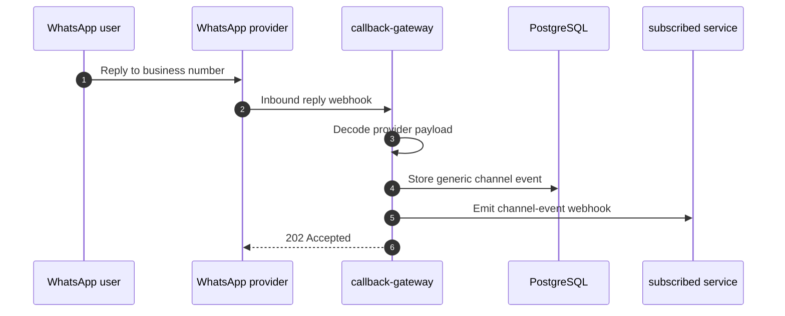

# WhatsApp Inbound Replies

This guide explains how the control plane handles WhatsApp replies from end users and forwards those replies to subscribed services such as `upstream service`.

It covers:

- what happens when a user replies to a WhatsApp notification
- how provider payloads are normalized
- how the control plane stores inbound events
- how lifecycle webhooks and channel-event webhooks differ
- how to test the flow locally

## What This Flow Is For

Outbound WhatsApp notifications already go through the normal send, provider callback, and delivery-tracking flow.

Inbound replies are different:

- a recipient sends a new message back to the business number
- the provider emits an inbound webhook
- the control plane stores that reply as a generic channel event
- subscribed services receive a webhook for the inbound event

This makes the reply flow reusable across services instead of hard-coding it for `upstream service`.

## High-Level Flow



## What Gets Stored

Inbound replies are stored as a generic `channel_event` record.

The stored event includes:

- `provider_key`
- `provider_account_id`
- `channel`
- `direction` = `inbound`
- `event_type`
- `status`
- `external_message_id`
- `reply_to_message_id`
- `conversation_id`
- sender and recipient addresses
- message body
- media metadata when present
- raw provider payload

This keeps the database schema generic so we can add more inbound channels later without creating one table per provider.

## Provider Support Today

The current implementation supports these WhatsApp inbound reply shapes:

- Gupshup WhatsApp inbound message webhooks
- Karix WhatsApp inbound replies normalized through the WhatsApp webhook shape

The provider-specific payloads are decoded in the callback gateway and normalized into the same internal event structure.

## Step 1: Configure The Provider Callback URL

Point the provider to the callback gateway endpoint for the WhatsApp provider.

Example:

```text
https://<your-control-plane-domain>/v1/providers/gupshup-whatsapp/callbacks
https://<your-control-plane-domain>/v1/providers/karix-whatsapp/callbacks
```

For local testing:

```text
http://localhost:8082/v1/providers/gupshup-whatsapp/callbacks
http://localhost:8082/v1/providers/karix-whatsapp/callbacks
```

## Step 2: Create A Callback Route

If the provider requires a shared secret or signature verification, create a callback route with the correct verification mode and secret reference.

Example:

```bash
curl -s -X POST http://localhost:8080/v1/callback-routes \
  -H 'Content-Type: application/json' \
  -d '{
    "provider_key": "gupshup-whatsapp",
    "provider_account_id": "<provider_account_id>",
    "callback_path": "/v1/providers/gupshup-whatsapp/callbacks",
    "verification_mode": "none",
    "enabled": true
  }'
```

If the provider uses a secret-based callback check, use `shared_secret` or `hmac_sha256` and mount the secret externally.

## Step 3: Register A Webhook Subscription For Consumers

If `upstream service` wants to receive reply events, it should register a webhook subscription that points to its reply receiver endpoint.

Example:

```bash
curl -s -X POST http://localhost:8080/v1/webhook-subscriptions \
  -H 'Content-Type: application/json' \
  -d '{
    "target_url": "https://upstream service.example.com/webhooks/notification-events",
    "enabled": true
  }'
```

The control plane will POST channel events to every enabled subscription.

## Step 4: Send A Notification And Reply To It

1. `upstream service` sends a WhatsApp notification through the control plane.
2. The provider accepts the outbound message.
3. The user replies to the WhatsApp business number.
4. The provider delivers the reply webhook to the control plane.
5. The callback gateway normalizes the reply and stores it.
6. The control plane sends a webhook event to subscribed services.

## Webhook Event Shape

Channel events are delivered as a JSON object with this general structure:

```json
{
  "event_type": "notification.channel_event.received",
  "event": {
    "event_id": "evt_123",
    "provider_key": "gupshup-whatsapp",
    "channel": "whatsapp",
    "direction": "inbound",
    "event_type": "reply_received",
    "status": "received",
    "external_message_id": "wamid.123",
    "reply_to_message_id": "gBEGkYaYVSEEAgnPFrOLcjkFjL8",
    "from_address": "918700491033",
    "body": "I need help with my order",
    "received_at": "2026-06-13T12:00:00Z"
  },
  "metadata": {
    "source": "callback-gateway",
    "provider": "gupshup-whatsapp",
    "channel": "whatsapp",
    "event_type": "reply_received"
  },
  "sent_at": "2026-06-13T12:00:00Z"
}
```

The exact payload fields may vary slightly depending on the provider, but the stored event and outbound webhook remain normalized.

## Step 5: Inspect Stored Replies

You can list recent inbound channel events through the API:

```bash
curl -s "http://localhost:8080/v1/channel-events?provider_key=gupshup-whatsapp&channel=whatsapp&limit=20"
```

This helps confirm that the inbound reply was received and persisted.

## Local Test Flow

The repository includes integration tests that exercise the reply path end to end.

The tests verify:

- provider-specific inbound payload decoding
- persistence into PostgreSQL
- webhook fanout to a subscriber endpoint

Relevant tests:

- `TestWhatsAppInboundRepliesAreStoredAndForwardedGupshup`
- `TestWhatsAppInboundRepliesAreStoredAndForwardedKarix`

## Operational Notes

- Replies are stored separately from delivery attempts.
- Delivery tracking still uses the existing callback flow.
- Reply handling is generic enough to add more channels later.
- Services that do not care about replies can ignore the channel-event webhook.

## Troubleshooting

If replies are not arriving:

1. verify the provider has the correct webhook URL configured
2. check that the callback route exists and is enabled
3. confirm the provider account exists and is enabled
4. inspect callback-gateway logs for decode or verification errors
5. query `/v1/channel-events` to see whether the inbound event was stored
6. verify the consumer webhook subscription is enabled and reachable

## Related Docs

- [Callbacks And Delivery Tracking](/docs/guides/callbacks-and-delivery-tracking.md)
- [Upstream Service Multi-Channel Integration](/docs/integrations/upstream-service-multi-channel.md)
- [Onboard Provider Accounts And Bindings](/docs/guides/onboard-provider-accounts-and-bindings.md)
- [Send Notifications](/docs/guides/send-notifications.md)
