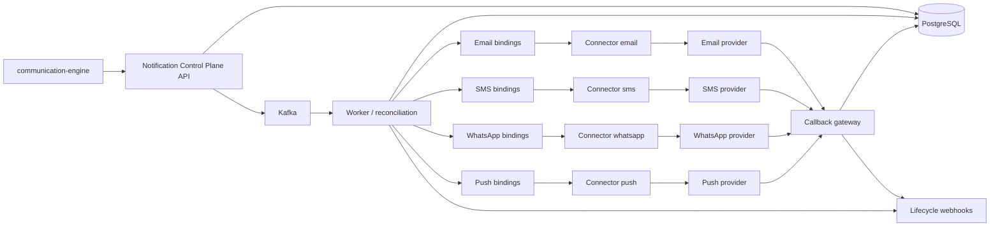

# Communication-Engine Multi-Channel Integration

This guide shows how `communication-engine` can integrate with the notification control plane across multiple channels:

- email
- SMS
- WhatsApp
- push

The control plane keeps the delivery mechanics. `communication-engine` keeps business intent, audience logic, and the event that triggered the notification.

## Big Picture

## How The Integration Works

`communication-engine` acts as the upstream application that decides:

- what business event happened
- which notification should be sent
- who should receive it
- which channel or channels are needed

It then submits a canonical notification request to the control plane.

The control plane then decides:

- which routing policy applies
- which binding set should be used
- which provider binding is active for that channel
- whether to retry, fail over, or dead-letter delivery

## Channel Mapping

### Email

- `communication-engine` creates a notification request with `channels: ["email"]`
- the worker resolves the email binding set
- the worker calls the email connector
- the email connector talks to the external email provider
- provider callbacks return through the callback gateway

### SMS

- `communication-engine` creates a notification request with `channels: ["sms"]`
- the worker resolves SMS bindings and provider order
- the worker can fail over between multiple SMS providers if the bindings are configured that way
- provider callbacks update request and attempt state

### WhatsApp

- `communication-engine` creates a notification request with `channels: ["whatsapp"]`
- the control plane routes it the same way as the other channels
- the worker sends it through a WhatsApp connector when that connector is wired into the deployment
- callback handling is the same durable loop as the other channels

### Push

- `communication-engine` creates a notification request with `channels: ["push"]`
- the worker resolves push bindings and the selected binding set
- the worker calls the push connector
- the push provider returns acceptance or failure, and later callbacks update durable state

## How Multiple Providers Fit In

If a single channel has multiple providers, the control plane does **not** need a separate API shape for each provider.

Instead:

1. `communication-engine` sends one canonical notification request.
2. The request chooses the channel.
3. The routing policy optionally chooses a binding set.
4. The worker loads all provider bindings for that channel and binding set.
5. The worker tries them in priority order and can fail over if one provider is unhealthy or fails transiently.

That means for SMS, for example, you can model:

- one binding for Gupshup
- one binding for Karix
- one binding for Twilio

Those bindings can all belong to the same channel, and they can share or split binding sets depending on how you want traffic to flow.

## Recommended Pattern For communication-engine

The cleanest shape is:

- `communication-engine` decides the business event and recipient
- the control plane decides delivery mechanics
- channel-specific provider choice stays in provider bindings, not in the app

That keeps provider changes out of `communication-engine`.

It also means you can:

- add a new SMS provider without changing product logic
- route some events to one provider pool and some to another
- keep retry, failover, and dead-letter behavior centralized

## Example Flow

1. `communication-engine` emits a notification intent.
2. It sends the request to the control plane API.
3. The API stores the request and queues the work.
4. The worker resolves the target channel and binding set.
5. The worker dispatches to the matching connector.
6. The connector talks to the external provider.
7. The provider callback arrives later and updates the stored delivery state.

## What You Should Configure

For each channel you want `communication-engine` to use, configure the provider account once during onboarding or deployment:

- a routing policy
- a binding set, if you want provider grouping
- provider accounts for the channel
- secret references stored securely in the control plane
- callback verification settings, if the provider needs them

For example:

- email can use one or more configured email provider accounts
- SMS can use one or more configured SMS provider accounts such as Twilio, Gupshup, or Karix
- WhatsApp can use a configured WhatsApp provider account
- push can use a configured FCM or APNs provider account

## Bottom Line

`communication-engine` does not need to understand every provider.

It only needs to speak the control-plane request model.
The notification control plane then handles channel routing, provider onboarding, provider selection, retries, failover, callbacks, and observability.
