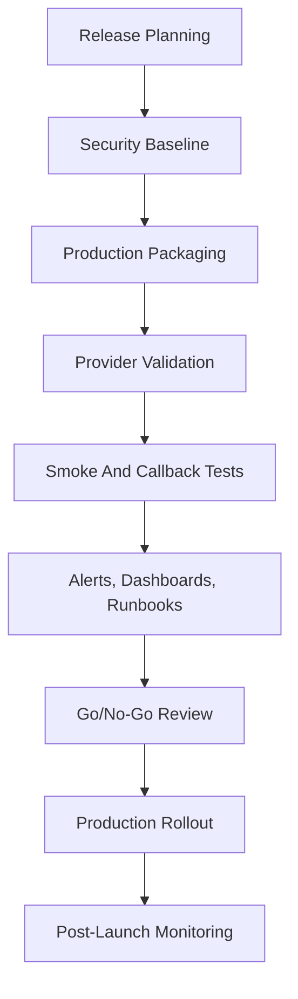

# Production Release Plan

This document is the detailed production-release plan for the Notification Control Plane.

It answers:

- what is already ready
- what is still pending before production
- what order we should complete the remaining work in
- what the release gates should be
- how to validate the platform before and after go-live

Use this together with:

- [Project Status](/Users/Shaik/notifications/notification-control-plane/docs/project-status.md)
- [Managed Provider Platform Design](/Users/Shaik/notifications/notification-control-plane/docs/architecture/managed-provider-platform.md)
- [Managed Provider Platform Implementation Plan](/Users/Shaik/notifications/notification-control-plane/docs/architecture/managed-provider-platform-implementation-plan.md)
- [Operator Guide](/Users/Shaik/notifications/notification-control-plane/docs/operator-guide.md)

## Release Goal

The production goal is:

`a trustworthy, operator-friendly, managed notification platform that upstream services can use without owning provider-specific delivery logic`

For release, that means:

- upstream services can authenticate and send canonical requests safely
- provider accounts and secrets are managed securely
- first-party connectors deliver reliably for supported channels
- callbacks and delivery tracking behave correctly
- operators can observe, troubleshoot, and recover the system
- deployment, rollback, and upgrade paths are defined

## Current State Summary

The platform already has strong foundations:

- API, worker, callback gateway, connectors, Postgres, and Kafka runtime
- managed provider accounts and connector-owned secret resolution
- first-party channel connectors for email, SMS, WhatsApp, push, and webhook
- routing, preferences, templates, retries, dead letters, and circuit breakers
- callback normalization for supported providers
- observability base with Prometheus and Grafana
- multilingual template support with English fallback
- detailed architecture and operator docs

The remaining release work is mostly around:

- security hardening
- production deployment packaging
- deeper automated validation
- operational maturity
- callback completeness and delivery semantics

## Release Decision Framework

We should split remaining work into three buckets.

### Must Be Done Before Production

These are release blockers.

- API authentication
- API authorization for configuration-changing endpoints
- production secret backend integration or production-grade mounted-secret model
- callback verification for every provider we claim as production-ready
- signed outbound lifecycle webhooks
- production deployment manifests and configuration strategy
- release pipelines for build, test, image publish, and deploy
- production alerting and runbooks
- backup and restore process for Postgres
- stronger end-to-end tests for the exact supported provider matrix

### Should Be Done Before Broad Adoption

These do not necessarily block the first controlled launch, but they should be completed before multiple teams rely on the platform heavily.

- tracing across services
- stronger chaos and failover testing
- retention jobs and audit-data cleanup
- richer dashboards for operator workflows
- capacity planning guidance
- explicit multi-channel partial-failure semantics

### Can Land After Initial Production Launch

- richer provider capability modeling
- more advanced operator workflows
- more provider adapters beyond the initial supported set
- deeper regional/compliance routing

## Production Scope Recommendation

The cleanest first production scope is:

- email:
  - `sendgrid-email` or `smtp-email`, depending on the environment strategy
- SMS:
  - `gupshup-sms`
  - `twilio-sms` if needed by the first adopters
- WhatsApp:
  - `gupshup-whatsapp`
- push:
  - `fcm-push`
- webhook:
  - signed webhook delivery

For first release, we should not market every adapter equally.

Recommended supported matrix:

- `gupshup-whatsapp`: supported
- `karix-whatsapp`: experimental unless it is validated live and callback-complete
- legacy compatibility paths: supported only as migration aids, not as the preferred product path

## Pending Work By Area

## 1. Security And Access Control

This is the highest-priority release area.

### What Is Still Pending

- add authentication for the northbound API
- add authorization or RBAC for admin/config APIs
- define service identity model for upstream clients
- ensure provider-management APIs are restricted
- sign outbound lifecycle webhooks
- verify inbound provider callbacks consistently
- add audit logs for config changes
- add API rate limiting and abuse protection

### Why This Blocks Production

Without auth and access control:

- any internal caller could mutate provider accounts or bindings
- callback endpoints are easier to spoof
- configuration changes are harder to trace
- the platform cannot be trusted as a shared internal service

### Concrete Deliverables

- bearer-token or service-token auth for all API endpoints
- role separation between:
  - send-only clients
  - config/admin clients
  - read-only operator clients
- audit entries for:
  - provider account create/update/disable
  - callback route create/update/disable
  - binding changes
  - template changes
  - routing and preference changes
- webhook signing with secret rotation support
- callback signature verification for all supported production providers

### Release Gate

Production is blocked until:

- all write endpoints require auth
- all provider callbacks are verified before state mutation
- auditability exists for config-changing operations

## 2. Secrets And Credential Management

The code now uses connector-side secret resolution, which is the right boundary. The remaining work is making the secret source production-grade.

### What Is Still Pending

- replace local/dev secret assumptions with a production secret source strategy
- define secret rotation process
- document secret mount conventions or secret-manager integration
- add secret-resolution metrics and operational alarms
- ensure no secret material leaks into logs or failure payloads

### Recommended Production Model

Prefer one of these:

1. mounted secrets managed by the orchestration platform
2. external secret manager integration with connector-side retrieval

Either model is acceptable if:

- secrets never live in Postgres
- secret refs are stable and typed
- connectors resolve secrets locally at runtime
- rotations do not require code changes by clients

### Concrete Deliverables

- production secret path convention
- secret rotation runbook
- secret-resolution failure alerts
- tests for `secret_string`, `secret_json`, and `secret_file`

### Release Gate

Production is blocked until:

- every production provider account uses a reviewed secret source
- secret rotation and failure handling are documented and testable

## 3. Provider And Channel Readiness

We need a disciplined answer for what is truly supported in production.

### Channel Review

#### Email

Pending checks:

- confirm the chosen production provider path
- if `sendgrid-email` is the main path, add callback completeness if delivery events matter
- if `smtp-email` is the main path, document that it is transport-based and define operational ownership of the SMTP server

#### SMS

Pending checks:

- validate the exact provider payloads and callbacks for each supported SMS provider
- decide whether both Twilio and Gupshup are first-release supported, or just one
- verify provider failover semantics do not cause unintended duplicate sends

#### WhatsApp

Pending checks:

- treat `gupshup-whatsapp` as the primary supported provider
- explicitly label `karix-whatsapp` as unsupported or experimental unless live-validated
- verify text, image, and approved-template flows end to end with callbacks

#### Push

Pending checks:

- validate the FCM project/account onboarding flow for every app using push
- document token, topic, and app/project ownership boundaries
- define push delivery semantics clearly because FCM acceptance is not the same as handset delivery

#### Webhook

Pending checks:

- ensure outbound webhook signing is implemented and documented
- verify retry and idempotency expectations for downstream consumers

### Concrete Deliverables

- a supported-provider matrix
- per-provider onboarding checklist
- per-channel callback support table
- provider readiness tests for the production matrix

### Release Gate

Production is blocked until:

- every provider we call production-ready has a validated send path
- callback behavior is either implemented or explicitly documented as acceptance-only

## 4. Data And Runtime Correctness

This area is about making sure the control plane behaves safely under real production conditions.

### What Is Still Pending

- stronger channel-recipient compatibility validation
- explicit multi-channel partial-failure semantics
- retention and cleanup jobs for old data
- clearer replay guarantees and idempotency semantics
- safer handling for slow or hung providers

### Concrete Deliverables

- request validation for:
  - email destination required for email
  - phone destination required for SMS and WhatsApp
  - push token or topic required for push
  - webhook URL required for webhook
- documentation of final request status semantics for:
  - fully delivered
  - partially delivered
  - accepted by provider but not callback-confirmed
- retention jobs for:
  - delivery attempts
  - webhook attempts
  - callback logs
  - old dead-letter rows, if policy allows
- timeout and retry standards for connectors

### Release Gate

Production is blocked until:

- request validation prevents obviously incompatible sends
- final-state semantics are clearly documented

## 5. Testing And Verification

The system already has a strong base, but production needs a much stricter release test matrix.

### What Is Still Pending

- broader unit coverage around routing and fallback
- full integration tests for the supported provider matrix
- failure injection and chaos tests
- migration upgrade tests
- release smoke tests

### Test Strategy

#### Unit Tests

Expand tests for:

- routing policy resolution
- binding-set selection
- multilingual template resolution and English fallback
- retry classification
- circuit breaker transitions
- callback normalization
- secret resolution

#### Integration Tests

Add end-to-end tests for:

- API -> Kafka -> worker -> connector -> callback-gateway
- dead-letter and replay
- failover across providers
- multilingual templates by channel
- provider-account onboarding

#### Failure Tests

Add controlled tests for:

- Postgres unavailable
- Kafka unavailable
- connector timeout
- callback verification failure
- secret backend unavailable
- circuit breaker open and recovery

#### Release Smoke Tests

Before every production release, run:

- DB migration apply
- API readiness
- worker consumption
- one send per supported production channel
- callback path verification for callback-capable providers

### Release Gate

Production is blocked until:

- release smoke tests exist and are repeatable
- the supported provider matrix has automated or scripted validation

## 6. Observability And Operations

The base is present, but the release needs real operator readiness.

### What Is Still Pending

- production alert rules
- tracing
- correlation IDs across all services
- production dashboards
- operational runbooks
- capacity planning guidance

### Concrete Deliverables

- alerts for:
  - Kafka lag
  - request failure spikes
  - retry spikes
  - callback verification failures
  - provider error spikes
  - secret resolution failures
  - DB latency or pool exhaustion
- correlation IDs that flow across:
  - API
  - worker
  - connector
  - callback gateway
  - lifecycle webhook notifier
- dashboards for:
  - request lifecycle
  - provider health
  - circuit breaker state
  - callback outcomes
  - connector latency
  - DLQ and replay
- runbooks for:
  - provider outage
  - callback outage
  - Kafka lag
  - DLQ replay
  - secret rotation
  - bad deployment rollback

### Release Gate

Production is blocked until:

- alerting exists for core failure modes
- operators have runbooks for the top incidents

## 7. Deployment, Release, And Rollback

This is the most visible production gap today.

### What Is Still Pending

- environment-specific deployment packaging
- immutable image build and publish flow
- release versioning
- upgrade and rollback strategy
- schema migration deployment strategy

### Concrete Deliverables

- Kubernetes manifests, Helm chart, or equivalent packaging
- environment variable and secret contract per service
- image publishing pipeline
- release tags and changelog discipline
- deployment order documentation:
  - migrate
  - core services
  - connectors
  - observability changes
- rollback plan for:
  - app deploy
  - connector deploy
  - migration rollback or forward-fix strategy

### Release Gate

Production is blocked until:

- deployment can be reproduced without local Docker assumptions
- rollback steps are documented and tested

## 8. Documentation And Adoption Readiness

The docs are strong, but release requires sharper production-facing guidance.

### What Is Still Pending

- explicit supported-provider table
- release operations handbook
- go-live checklist
- post-deploy verification checklist
- client onboarding quickstart for production

### Concrete Deliverables

- one doc for upstream service onboarding in production
- one doc for provider-account onboarding in production
- one doc for production operations and incident response
- one doc for release checklist and go/no-go approval

## Production Release Workstreams

The most efficient way to ship this is to run several workstreams in parallel.

### Workstream A: Security

Owner area:

- API
- callback gateway
- webhook notifier

Deliverables:

- auth
- RBAC
- callback verification completeness
- signed lifecycle webhooks
- audit logs

### Workstream B: Deployment

Owner area:

- deployment
- CI/CD
- migrations

Deliverables:

- production packaging
- image publishing
- deployment pipeline
- rollback process

### Workstream C: Provider Readiness

Owner area:

- connectors
- callback gateway
- docs

Deliverables:

- supported provider matrix
- live validation scripts
- callback coverage
- provider onboarding guides

### Workstream D: Reliability

Owner area:

- worker
- storage
- tests

Deliverables:

- validation hardening
- failure semantics
- cleanup jobs
- broader automated tests

### Workstream E: Operations

Owner area:

- observability
- operator docs

Deliverables:

- alerts
- dashboards
- runbooks
- capacity guidance

## Recommended Delivery Order

This is the recommended order for completing the remaining production work.

1. Security baseline
2. Production deployment packaging
3. Provider support narrowing and validation
4. Release smoke-test suite
5. Alerting, dashboards, and runbooks
6. Data-retention and cleanup jobs
7. Wider chaos and scale validation

## Release Milestones

## Milestone 1: Controlled Internal Production

Goal:

- one or two upstream services
- narrow provider matrix
- strong operational visibility

Required before this milestone:

- auth enabled
- provider secrets mounted or resolved through approved production path
- deployment packaging ready
- one production callback path validated
- runbooks and alerts ready

## Milestone 2: Shared Internal Platform

Goal:

- more upstream clients
- broader channel usage
- stronger operator tooling

Required before this milestone:

- RBAC
- stronger audit logging
- capacity guidance
- richer dashboards
- broader provider matrix validation

## Milestone 3: Mature Managed Provider Platform

Goal:

- standardized onboarding
- consistent release and rollback
- confidence under failure scenarios

Required before this milestone:

- chaos testing
- tracing
- stronger callback parity
- cleanup and retention automation

## Go-Live Checklist

Before production launch, confirm all of the following.

- API auth is enabled
- admin/config endpoints are protected
- provider secrets are not env-hacked or local-machine-dependent
- production deployment manifests are ready
- migrations have been tested in a production-like environment
- backup and restore has been tested
- supported provider matrix is documented
- smoke tests pass for all supported channels
- alerts are configured
- dashboards are available to operators
- runbooks exist for top incidents
- rollback steps are documented
- on-call ownership is defined

## Sequence Diagram

## Post-Launch Plan

The release does not end at deployment.

For the first production launch, keep a defined hypercare window.

### First 24 Hours

- watch request acceptance rate
- watch provider error rates
- watch Kafka lag
- watch callback success rate
- watch secret-resolution failures
- watch DLQ growth

### First Week

- review provider-specific failures
- review retry and circuit-breaker behavior
- review webhook consumer issues
- review scaling and latency pressure
- review noisy alerts and dashboard usefulness

### After Stabilization

- narrow or expand the officially supported provider matrix
- decide what moves from experimental to supported
- prioritize remaining hardening work from real production learnings
